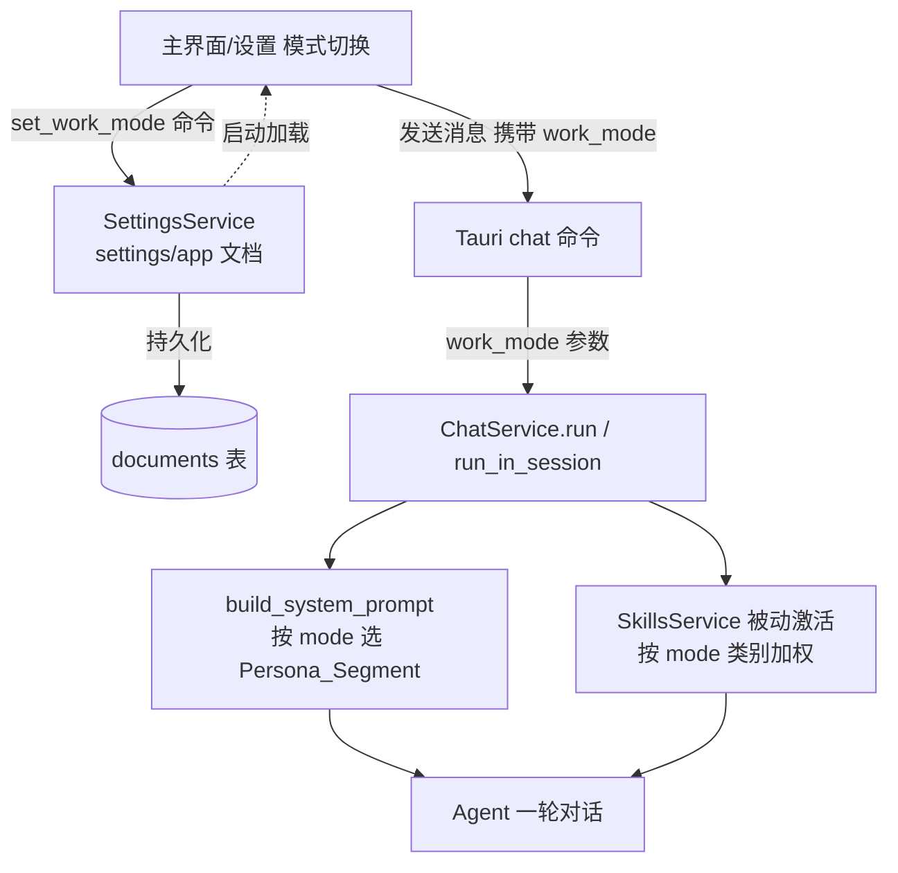

# 技术设计文档：日常使用模式（daily-office-mode）

## Overview

本设计描述如何把现有的"工作模式"开关（code / daily）从纯 UI 摆设变成真正改变 agent 行为的功能，并接入面向办公的 skills。核心是一条贯穿前后端的数据通路：

**UI 切换模式 → 持久化到后端设置 → 每轮对话把 work_mode 透传给 ChatService → 系统提示按模式选人格 + skills 按模式加权排序。**

设计严格遵守两条硬约束：
- **不新增 crate**：所有改动落在现有 crate（deepagent-app-core、deepagent-skills）和前端。
- **code 路径字节不变**：daily 人格作为独立分支注入，code 模式产出的系统提示与本特性之前逐字节一致，保住 DeepSeek 的前缀缓存。

## Architecture

### 数据流



### 分层职责

| 层 | 改动 |
|----|------|
| 前端（apps/desktop） | 模式切换写后端、Mode_Badge、发消息透传 work_mode、多处状态同步 |
| Tauri 命令层 | get_work_mode / set_work_mode；chat 命令增加 work_mode 入参 |
| deepagent-app-core | WorkMode 枚举、SettingsService 读写、ChatService 透传、SystemPromptBuilder 人格分支、SkillsService 模式排序、SkillDto.category |
| deepagent-skills | SkillMeta.category 字段、frontmatter category 解析、SkillRegistry 模式加权 |

## Components and Interfaces

### 1. WorkMode 枚举（deepagent-app-core）

```rust
#[derive(Debug, Clone, Copy, PartialEq, Eq, Serialize, Deserialize, Default)]
#[serde(rename_all = "lowercase")]
pub enum WorkMode {
    #[default]
    Code,
    Daily,
}
```
- serde 序列化为 `"code"` / `"daily"`，默认 `Code`
- 提供 `as_str()` / `parse(&str) -> WorkMode`（未知值容错回退 Code）
- 放在 deepagent-app-core（如 `work_mode.rs` 或并入 settings 模块），不新增 crate

### 2. SettingsService 持久化（deepagent-app-core/src/settings.rs）

- 在 settings/app 持久化文档（documents 表 collection="settings" id="app"）的结构体中新增字段：
  ```rust
  #[serde(default)]
  pub work_mode: WorkMode,
  ```
  `#[serde(default)]` 保证旧配置（无该字段）反序列化为 Code，满足向后兼容（需求 8.2）
- 新增方法：`get_work_mode(&self) -> WorkMode`、`set_work_mode(&self, mode: WorkMode) -> Result<()>`（读改写该文档）

### 3. Tauri 命令（apps/desktop/src-tauri）

- `get_work_mode() -> WorkMode`：读设置
- `set_work_mode(mode: WorkMode)`：写设置
- 现有 chat 调用命令（启动/继续对话）增加 `work_mode: WorkMode` 入参，转发给 ChatService

### 4. ChatService 透传（deepagent-app-core/src/chat_service.rs）

现有签名：
```rust
pub async fn run<F, A>(&self, prompt: &str, on_event: F, on_approval: A) -> Result<String>
pub async fn run_in_session<F, A>(&self, prompt: &str, continue_session: Option<...>, on_event: F, on_approval: A) -> Result<...>
```

改法（二选一，设计推荐 A）：
- **方案 A（推荐，显式参数）**：给 run / run_in_session 增加 `work_mode: WorkMode` 参数。改动所有调用点（Tauri 命令层）。缺省由调用方传 Code。语义清晰、每轮可变（满足需求 2.5）。
- 方案 B（服务字段）：ChatService 持 `work_mode`，新增 setter。不改方法签名但隐式状态、并发下每轮可变性差。**不采用**。

run 内部把 work_mode 传给：
- `build_system_prompt(work_mode, ...)` 选人格
- SkillsService 被动激活调用，传 work_mode 做排序

缺省：未提供时用 `WorkMode::default()` = Code（需求 2.4）。

### 5. SystemPromptBuilder 人格分支（chat_service.rs + crate::system_prompt）

关键约束：**保前缀缓存 + code 字节不变**。

设计：
- `build_system_prompt(work_mode, ...)` 内，在静态前缀组装阶段按 mode 选择是否插入 daily Persona_Segment：
  ```rust
  match work_mode {
      WorkMode::Code => system_prompt_base(),                 // 与现状逐字节相同
      WorkMode::Daily => format!("{}{}", system_prompt_base(), DAILY_PERSONA_SEGMENT),
  }
  ```
- **code 分支必须调用与现状完全相同的组装路径**，不得因引入 mode 改动任何 code 路径的字节（需求 3.2、8.1、9.4）
- DAILY_PERSONA_SEGMENT 是常量字符串，放在静态侧（Prompt_Boundary 之前），保证同一 mode 多次运行静态前缀逐字节一致 → 前缀缓存命中（需求 3.3、3.4）
- daily 人格文案要点：面向办公、平实口语、少技术黑话、默认给结论再给步骤、避免代码术语堆砌（需求 3.5）

> 注意：daily 段放在静态前缀末尾会使 daily 与 code 的缓存前缀在分叉点之后不同——这是预期的（两种模式各自维护自己的可缓存前缀），关键是**同一模式内**前缀稳定。

### 6. SkillMeta.category（deepagent-skills/src/skill.rs）

```rust
#[derive(Debug, Clone, Copy, PartialEq, Eq, Serialize, Deserialize, Default)]
#[serde(rename_all = "lowercase")]
pub enum SkillCategory {
    Office,
    Coding,
    #[default]
    General,
}
```
- SkillMeta 新增 `pub category: SkillCategory`
- frontmatter 解析（crate::frontmatter::Frontmatter）：读 `category` 键
  - 缺省 → General（需求 4.3）
  - 非法值（不在 office/coding/general）→ General + 记 `tracing::warn` 解析告警（需求 4.4）
- SkillDto（deepagent-app-core/src/skills_service.rs）暴露 category 字段（需求 4.5）

### 7. SkillRegistry 模式加权（deepagent-skills/src/registry.rs）

现有 `match_query` 返回 `Vec<SkillMatch { id, score: f32, matched_triggers }>`，按 trigger 权重打分。

设计新增按模式排序的入口（保留原 match_query 不破坏现有调用）：
```rust
pub fn match_query_for_mode(&self, query: &str, mode: WorkMode) -> Vec<SkillMatch>
```
或在 Skills_Service 层对 match_query 结果做二次类别加权排序。加权算法：
- 先按原 trigger score 打分
- 再按 mode 给类别加权后排序：
  - daily：office 加权 > coding（如 office *1.0、coding *0.5、general *0.8）
  - code：coding 加权 > office（coding *1.0、office *0.5、general *0.8）
  - general 在任何模式都保留为候选（需求 5.3）
- 排序键：(category_weight × trigger_score) 降序；分相同按原顺序稳定排序
- WorkMode 类型：deepagent-skills 不依赖 app-core，故在 deepagent-skills 内也需要一个 mode 概念——设计采用：registry 层接受一个轻量 `mode: WorkMode` 由 app-core 传入（若 deepagent-skills 不便依赖 app-core 的 WorkMode，则在 deepagent-skills 定义等价的 `SkillSelectionMode { Office, Coding }`，由 app-core 映射传入，避免跨 crate 依赖倒置）

> 设计决策：为避免 deepagent-skills 反向依赖 deepagent-app-core，在 deepagent-skills 内定义排序所需的最小 mode 枚举，app-core 的 WorkMode 在调用时映射过去。这不新增 crate。

### 8. 办公 skill 发现与激活（SkillsService）

- 复用现有 skill 发现（SkillManager/SkillsRoots）——office skills 只是带 category=office 的普通 skill，发现机制不变（需求 6.1、6.4）
- daily 模式：被动激活把 office skills 纳入候选并加权靠前（需求 6.2）
- code 模式：不自动优先 office skills（需求 6.3）——即排序权重把 office 压低，但 general 仍候选

### 9. 前端改动（apps/desktop/src）

| 文件 | 改动 |
|------|------|
| StartView.tsx | 主界面模式切换调 `set_work_mode` 命令（替代仅写 localStorage）；显示 Mode_Badge（当前模式）；发消息时把当前 work_mode 透传给 chat 命令 |
| GeneralSettings.tsx | 模式设置项调 set_work_mode；与主界面状态同步 |
| OnboardingWizard.tsx | 选择模式后调 set_work_mode 持久化 |
| api.ts / types.ts | 增加 getWorkMode/setWorkMode 封装、WorkMode 类型；chat 调用增加 work_mode 入参 |
| 状态同步 | work_mode 作为单一真相源（后端设置），各处读取同一值，切换后广播刷新（需求 1.5、7.2） |
| Mode_Badge | 轻量标识（如 "Office Mode" / "编程模式"），放主界面顶部，切换即时更新、无需重启（需求 7.1、7.4） |

## Data Models

### WorkMode（app-core）
`Code | Daily`，serde lowercase，默认 Code。

### SkillCategory（deepagent-skills）
`Office | Coding | General`，serde lowercase，默认 General。

### 设置文档新增字段（settings/app）
```rust
struct AppSettings {
    // ... 现有字段
    #[serde(default)]
    work_mode: WorkMode,
}
```

### SkillMeta 新增字段
```rust
struct SkillMeta {
    // ... 现有
    #[serde(default)]
    category: SkillCategory,
}
```

### SkillDto 新增字段
```rust
struct SkillDto {
    // ... 现有
    category: SkillCategory,
}
```

### 不变量
1. work_mode 仅 code/daily；未知/缺失 → code
2. category 仅 office/coding/general；未知/缺失 → general
3. code 模式系统提示静态前缀 = 本特性之前逐字节相同
4. 同一 work_mode 多次运行的静态前缀逐字节一致（前缀缓存）
5. 所有现有 skill（无 category）默认 general 且照常可用

## 错误处理

- frontmatter category 非法 → 回退 general + tracing::warn，不中断 skill 加载（需求 4.4、8.4）
- 设置文档缺 work_mode → serde default Code（需求 8.2）
- run 未传 work_mode → 用 Code（需求 2.4）
- set_work_mode 写失败 → 返回 Result 错误，前端提示，不影响当前对话

## 测试策略

**单元测试（需求 9.3）**：
- WorkMode 人格选择：daily 含 Persona_Segment；code 输出与基线逐字节相同（快照/字节比对）
- 同一 mode 两次 build_system_prompt 的静态前缀逐字节一致
- SkillCategory frontmatter 解析：声明 office/coding/general 正确；缺省 general；非法值 general + 告警
- 模式加权排序：daily 下 office 排 coding 前；code 下 coding 排 office 前；general 两模式都在候选
- 设置往返：set_work_mode → get_work_mode 一致；旧配置（无字段）→ Code

**集成测试**：
- 端到端：set_work_mode(daily) → run 携带 daily → 系统提示含办公人格 + office skill 被动激活靠前
- 向后兼容：未设模式的旧会话 run → code 行为不变

**质量门禁（需求 9.1、9.2）**：
- 不新增 crate（仅改 deepagent-app-core / deepagent-skills / 前端）
- cargo clippy --workspace -D warnings 无新增告警
- 前端 pnpm build 通过

## 关键设计决策小结

1. **mode 显式透传**（方案 A）而非服务隐式字段——保证每轮可变、并发安全
2. **daily 人格独立分支 + code 路径零改动**——保前缀缓存、保向后兼容
3. **deepagent-skills 不反向依赖 app-core**——排序 mode 用本 crate 最小枚举，app-core 映射传入，不新增 crate
4. **category 缺省 general + 容错**——所有现存 skill 零改动照常工作