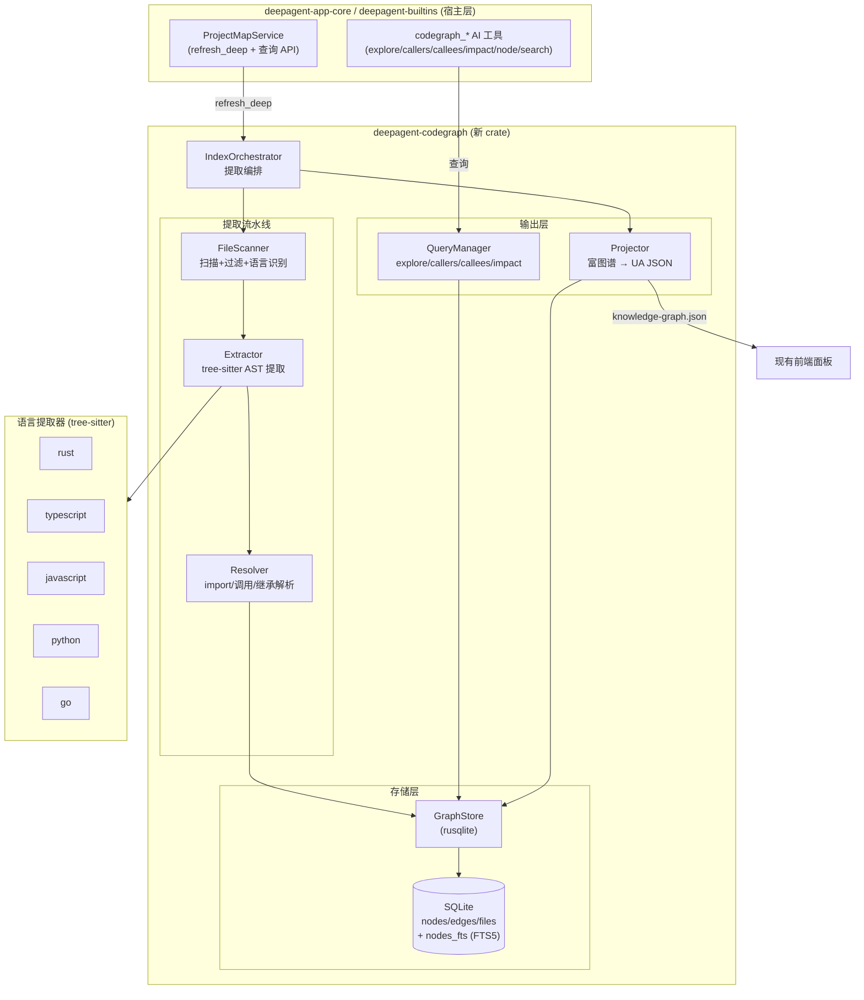

# Design Document: CodeGraph 双引擎项目理解系统

## Overview

本设计描述一个纯 Rust 实现的代码图谱引擎 `deepagent-codegraph`，它用 tree-sitter 解析项目源码、在 SQLite 中构建符号级知识图谱，并同时服务两个消费者：

- **AI 消费者**：通过 `codegraph_*` 工具直接查询 SQLite，一次拿到结构化答案（符号源码 + 调用链），替代昂贵的 grep/read 探索。
- **人类消费者**：通过投影器把富图谱降维成现有 `.understand-anything/knowledge-graph.json`，喂给现有前端项目地图面板，零改动。

**核心设计原则：**
- **一次提取，两路输出**：tree-sitter 只解析一次，富图谱存 SQLite，AI 查询和 UA 投影都是它的视图，不重复扫描。
- **零外部进程**：彻底删除 Node.js 子进程调用，纯 Rust 编译集成 tree-sitter grammar，修复 `ERR_MODULE_NOT_FOUND` 报错。
- **精确优先**：用 tree-sitter AST 而非正则，确保调用图（callers/callees/impact）可靠。
- **增量友好**：基于文件 content_hash 检测变更，仅重新提取变更文件。
- **API 兼容**：保留 `ProjectMapService` 全部公开查询 API 和现有前端格式。
- **分期可交付**：一期提取+存储+投影，二期调用图+AI工具，三期 watcher+广度。

## Architecture

### 高层架构



### 数据流

**全量索引（首次 refresh_deep）：**
```
项目根目录
  → FileScanner: 递归扫描、过滤、语言识别 → Vec<ScannedFile>
  → Extractor: 每个文件 tree-sitter 解析 → 节点 + 边 + 未解析引用
  → GraphStore: 批量写入 nodes/edges/files
  → Resolver: 解析 import 目标 + 未解析调用 → 补充 calls/imports 边
  → Projector: 查 SQLite → 降维 → 写 knowledge-graph.json
```

**增量索引（再次 refresh_deep）：**
```
git diff / content_hash 比对 → 变更文件列表
  → 删除变更文件的旧节点+边（级联）
  → 仅重新提取变更文件
  → 局部 Resolver 重解析
  → 标记 changed 节点 → 重新投影
```

**AI 查询（运行时）：**
```
codegraph_explore(["FuncA", "ClassB.method"])
  → QueryManager: FTS5 定位符号 → 图遍历找调用路径 → 取源码
  → 按文件分组返回（含调用链）
```

### crate 内模块布局

```
deepagent-codegraph/
├── src/
│   ├── lib.rs            // CodeGraph 门面：index_all / sync / query / project
│   ├── types.rs          // NodeKind / EdgeKind / Node / Edge / FileRecord
│   ├── scanner.rs        // FileScanner：扫描、过滤、语言识别
│   ├── extraction/
│   │   ├── mod.rs        // Extractor + ExtractionOrchestrator
│   │   ├── language.rs   // Language 枚举 + grammar 注册 + 扩展名映射
│   │   ├── queries.rs    // 每语言 tree-sitter query (.scm 规则)
│   │   ├── rust.rs       // Rust 提取器
│   │   ├── typescript.rs // TS/JS 提取器
│   │   ├── python.rs     // Python 提取器
│   │   └── go.rs         // Go 提取器
│   ├── resolution/
│   │   ├── mod.rs        // Resolver 编排
│   │   ├── import_resolver.rs  // import 路径解析（含别名）
│   │   └── name_matcher.rs     // 调用引用→定义名称匹配
│   ├── store/
│   │   ├── mod.rs        // GraphStore (rusqlite)
│   │   ├── schema.rs     // schema SQL + 迁移
│   │   └── queries.rs    // prepared statements
│   ├── query/
│   │   ├── mod.rs        // QueryManager
│   │   ├── traverser.rs  // 图遍历：BFS/DFS、impact、调用路径
│   │   └── explore.rs    // explore：符号集 → 源码+调用路径分组
│   └── projection/
│       ├── mod.rs        // Projector：富图谱 → UA JSON
│       ├── layers.rs     // 层级分类
│       └── tour.rs       // 导览生成
```

## Components and Interfaces

### 1. CodeGraph（门面）

**职责**：对外统一入口，宿主只依赖此门面。

```rust
pub struct CodeGraph {
    store: GraphStore,
    project_root: PathBuf,
}

impl CodeGraph {
    /// 打开或创建项目图谱数据库（.codegraph/codegraph.db）。
    pub fn open(project_root: &Path) -> Result<Self>;

    /// 全量索引：扫描→提取→解析→存储。返回统计。
    pub async fn index_all(&mut self) -> Result<IndexStats>;

    /// 增量同步：仅处理变更文件。
    pub async fn sync(&mut self) -> Result<IndexStats>;

    /// 投影为 UA knowledge-graph.json。
    pub fn project_ua_json(&self, out_path: &Path) -> Result<ProjectionStats>;

    // ---- AI 查询 ----
    pub fn search(&self, query: &str, kind: Option<NodeKind>, limit: usize) -> Result<Vec<NodeHit>>;
    pub fn explore(&self, symbols: &[String], budget: ExploreBudget) -> Result<ExploreResult>;
    pub fn callers(&self, symbol: &str, limit: usize) -> Result<Vec<CallSite>>;
    pub fn callees(&self, symbol: &str, limit: usize) -> Result<Vec<CallSite>>;
    pub fn impact(&self, symbol: &str, depth: usize) -> Result<ImpactResult>;
    pub fn node(&self, symbol_or_file: &str) -> Result<NodeDetail>;
}

pub struct IndexStats {
    pub files_indexed: usize,
    pub nodes: usize,
    pub edges: usize,
    pub duration: Duration,
    pub is_incremental: bool,
}
```

### 2. FileScanner

**职责**：递归扫描、过滤、语言识别（复用旧设计的扫描逻辑）。

```rust
pub struct FileScanner {
    ignore_matcher: Option<ignore::gitignore::Gitignore>,
}

pub struct ScannedFile {
    pub path: PathBuf,
    pub relative_path: PathBuf,
    pub language: Language,
    pub size: u64,
    pub content_hash: String,   // 用于增量比对
}

impl FileScanner {
    pub fn new(project_root: &Path) -> Result<Self>;
    pub fn scan(&self, project_root: &Path) -> Result<Vec<ScannedFile>>;
}
```

**关键行为**：跳过 `.git`/`node_modules`/`target`/`dist`/`build`/`__pycache__`/`.venv`；过滤二进制和 >1.5MB；遵守 `.gitignore`；计算 content_hash（如 xxhash/blake3）。

### 3. Language + Grammar 注册

```rust
#[derive(Debug, Clone, Copy, PartialEq, Eq, Hash)]
pub enum Language {
    Rust, TypeScript, JavaScript, Python, Go,
    // 三期扩展：Java, CSharp, Cpp, Ruby, ...
    Other,  // 仅登记 file 节点，不提取符号
}

impl Language {
    pub fn from_extension(ext: &str) -> Language;
    pub fn from_path(path: &Path) -> Language;  // 处理 Dockerfile/Makefile 等
    /// 返回该语言的 tree-sitter Language（grammar）。
    pub fn ts_language(&self) -> Option<tree_sitter::Language>;
}
```

一期 grammar 依赖：`tree-sitter`、`tree-sitter-rust`、`tree-sitter-typescript`、`tree-sitter-javascript`、`tree-sitter-python`、`tree-sitter-go`（均纯 Rust 可编译，C grammar 经 `cc` 本地编译）。

### 4. Extractor

**职责**：用 tree-sitter 解析单文件 AST，按语言 query 规则提取节点和边。

```rust
pub struct Extractor {
    parsers: HashMap<Language, ExtractorImpl>,
}

pub struct ExtractedFile {
    pub file: ScannedFile,
    pub nodes: Vec<Node>,
    pub edges: Vec<Edge>,
    pub unresolved_refs: Vec<UnresolvedRef>,
}

impl Extractor {
    pub fn new() -> Self;
    pub fn extract(&self, file: &ScannedFile, source: &str) -> Result<ExtractedFile>;
}

/// 每语言实现：用 tree-sitter Query 匹配 AST 节点。
trait ExtractorImpl {
    fn extract(&self, tree: &tree_sitter::Tree, source: &str, file: &ScannedFile)
        -> ExtractedFile;
}
```

**提取策略**：每种语言用 tree-sitter Query（`.scm` S-表达式）匹配函数/类/方法/import/调用表达式。调用表达式提取出被调用名 → 生成 `UnresolvedRef`（留待 Resolver）。文件内能直接解析的（如同文件函数）直接生成 `calls` 边。

**容错**：解析失败的文件跳过 + warn，不中断整体。

### 5. Resolver

**职责**：全量提取后解析跨文件引用。

```rust
pub struct Resolver<'a> {
    store: &'a GraphStore,
}

impl<'a> Resolver<'a> {
    /// 解析所有 unresolved_refs，生成 calls/imports 边。
    pub fn resolve_all(&self) -> Result<ResolveStats>;

    /// 仅解析涉及指定文件的引用（增量）。
    pub fn resolve_for_files(&self, files: &[PathBuf]) -> Result<ResolveStats>;
}
```

**解析逻辑**：
- **import 解析**：相对路径（`./`、`../`）→ 拼接解析；包路径（Rust `crate::`/`super::`、JS `@scope/pkg`）→ 别名表解析；tsconfig paths / cargo workspace member globs。
- **调用解析**：未解析引用名 → 在 nodes 表按 name/qualified_name 查候选 → 多候选按（同文件 > 同模块 > 限定名匹配）排序 → 生成 `calls` 边，启发式得出的标 `provenance="heuristic"`。

### 6. GraphStore (rusqlite + FTS5)

**职责**：SQLite 持久化层。

```rust
pub struct GraphStore {
    conn: rusqlite::Connection,
}

impl GraphStore {
    pub fn open(db_path: &Path) -> Result<Self>;     // 建表 + 迁移
    pub fn upsert_file(&self, file: &FileRecord) -> Result<()>;
    pub fn insert_nodes(&self, nodes: &[Node]) -> Result<()>;
    pub fn insert_edges(&self, edges: &[Edge]) -> Result<()>;
    pub fn delete_file_cascade(&self, path: &str) -> Result<()>;  // 删节点+边
    pub fn changed_files(&self, scanned: &[ScannedFile]) -> ChangeSet;  // content_hash 比对
    pub fn search_fts(&self, query: &str, kind: Option<NodeKind>, limit: usize) -> Result<Vec<Node>>;
    pub fn edges_from(&self, node_id: &str, kind: EdgeKind) -> Result<Vec<Edge>>;
    pub fn edges_to(&self, node_id: &str, kind: EdgeKind) -> Result<Vec<Edge>>;
    pub fn node_by_id(&self, id: &str) -> Result<Option<Node>>;
    pub fn all_file_nodes(&self) -> Result<Vec<Node>>;
    // ... 项目元数据读写
}
```

**Schema**（参考 codegraph schema.sql，用 rusqlite 重建）：nodes / edges / files / unresolved_refs / schema_versions / project_metadata 表 + nodes_fts FTS5 虚拟表 + 同步触发器 + 性能索引（见 Data Models）。

需在工作区 `rusqlite` 特性中启用 `fts5`（bundled SQLite 自带 FTS5）。

### 7. QueryManager + Traverser

**职责**：AI 查询的核心逻辑。

```rust
pub struct QueryManager<'a> {
    store: &'a GraphStore,
}

impl<'a> QueryManager<'a> {
    pub fn search(&self, q: &str, kind: Option<NodeKind>, limit: usize) -> Result<Vec<NodeHit>>;
    pub fn explore(&self, symbols: &[String], budget: ExploreBudget) -> Result<ExploreResult>;
    pub fn callers(&self, symbol: &str, limit: usize) -> Result<Vec<CallSite>>;
    pub fn callees(&self, symbol: &str, limit: usize) -> Result<Vec<CallSite>>;
    pub fn impact(&self, symbol: &str, depth: usize) -> Result<ImpactResult>;
    pub fn node(&self, target: &str) -> Result<NodeDetail>;
}
```

**explore 算法**（CodeGraph 的核心价值）：
1. 把输入符号名集合用 FTS5/精确匹配定位到 nodes。
2. 在 `calls` 边构成的子图上，找这些命名符号之间的调用路径（允许 ≤1 个未命名中间节点桥接，避免在 god-function 上发散）。
3. 取每个相关符号的源码片段（按 start_line/end_line 从文件读取或缓存）。
4. 按文件分组输出，开头给出调用路径（Flow）。
5. 输出预算随项目规模缩放（小项目 1 次调用够，大项目最多 3-5 次）。

**impact 算法**：从目标符号出发，沿 `calls`/`references` 边反向 BFS，收集直接和间接调用者，按深度分层。

### 8. Projector

**职责**：把 SQLite 富图谱降维成 UA `knowledge-graph.json`。

```rust
pub struct Projector<'a> {
    store: &'a GraphStore,
}

impl<'a> Projector<'a> {
    pub fn project(&self, project_root: &Path, out_path: &Path) -> Result<ProjectionStats>;
}
```

**降维规则**：
- **节点**：file 节点 → UA file 节点；function/method/class/struct → UA function/class/module 节点（映射 NodeKind 到 UA 的 type）。复杂度按行数算（≥500 complex / ≥150 moderate / else simple）。
- **边**：`contains` → UA contains；`imports` → UA imports。`calls`/`extends`/`implements` 等 UA 不支持的边降维为 `related` 或省略（确保前端 schema 兼容）。
- **层级**：调 `layers.rs` 按路径分类。
- **导览**：调 `tour.rs` 拓扑排序/层级分组。
- **元数据**：扫描 manifest（package.json/Cargo.toml/...）得 name/description/languages/frameworks；写 analyzedAt + gitCommitHash。

### 9. ProjectMapService 改造

```rust
impl ProjectMapService {
    pub async fn refresh_deep(&self, project_root: &Path) -> Result<ProjectMapRefreshDto> {
        let start = Instant::now();
        let root = project_root.canonicalize()?;

        // 原生引擎替代 Node.js
        let mut graph = CodeGraph::open(&root)?;
        let stats = if graph.has_existing_index() {
            graph.sync().await?           // 增量
        } else {
            graph.index_all().await?      // 全量
        };

        // 投影 UA JSON（前端兼容）
        let ua_path = root.join(".understand-anything/knowledge-graph.json");
        graph.project_ua_json(&ua_path)?;

        Ok(ProjectMapRefreshDto { /* 统计 */ })
    }
    // status/overview/search/node/neighbors/graph/impact 保持不变
}
```

**删除**：`locate_understand_plugin_root`、`ensure_understand_core_built`、`pnpm_command`、Node 子进程逻辑、`understand-deep-map.mjs`、硬编码外部路径。

### 10. AI 工具（deepagent-builtins）

新增 `codegraph_tools.rs`，沿用现有 `ProjectMapBackend` 模式定义 `CodeGraphBackend` trait，host 在 `deepagent-app-core` 实现桥接到 `CodeGraph`。

```rust
#[async_trait]
pub trait CodeGraphBackend: Send + Sync {
    async fn search(&self, query: &str, kind: Option<String>, limit: usize) -> Result<Value>;
    async fn explore(&self, symbols: Vec<String>) -> Result<Value>;
    async fn callers(&self, symbol: &str, limit: usize) -> Result<Value>;
    async fn callees(&self, symbol: &str, limit: usize) -> Result<Value>;
    async fn impact(&self, symbol: &str, depth: usize) -> Result<Value>;
    async fn node(&self, target: &str) -> Result<Value>;
}

// 6 个工具：CodeGraphSearchTool / ExploreTool / CallersTool /
//          CalleesTool / ImpactTool / NodeTool
// 全部 RiskLevel::Safe + PermissionSet::read_only()
```

**未索引时**：返回成功形态的提示（`ToolOutput::success` 带引导文本），而非 error——避免 agent 因 error 放弃使用工具。

### 11. Read-Tool Steering（codegraph 优先读取）

**职责**：引导现有读取工具（read_file/grep/glob/list_dir）在理解代码时优先走 codegraph，而非盲读源文件。采用**软引导**——不改这些工具的功能实现，仅通过系统提示与工具描述施加引导，保留裸读兜底。

**机制**：
1. **系统提示工具指引段**新增引导文案：
   - 理解代码逻辑/调用链/影响面 → `codegraph_explore`
   - 取某符号完整源码 + 调用轨迹 → `codegraph_node`
   - 定位符号 → `codegraph_search`（而非 grep）
   - 把 codegraph 返回源码视为"已读取"，不重复验证
2. **工具描述更新**：
   - `read_file.description` 补充："为理解代码逻辑而读取时优先用 codegraph_node/explore；本工具用于非代码文件、编辑前置精确读、codegraph 不适用的兜底。"
   - `grep.description` 补充："搜索代码符号优先用 codegraph_search；本工具用于字符串字面量/注释/配置等非符号文本。"

**兜底矩阵（始终允许裸读，不引导走 codegraph）**：

| 场景 | 原因 |
|------|------|
| 编辑前置读（edit_file/multi_edit/write_file 要求先 read_file） | codegraph 富视图非字节精确，无法用于精确替换 |
| 非代码文件（config/json/markdown/log） | codegraph 不提取符号 |
| 未索引项目 / 不支持语言（Other） | 无图谱可查 |
| 解析失败文件 | tree-sitter 跳过，图谱无该文件符号 |

**不改动**：read_file/grep/glob/list_dir 的功能实现、WorkspaceRoot 守卫、文件缓存、编辑不变量全部保持原样。本特性纯粹是"引导层"。

### 12. Error Locator（报错 → 代码定位）

**职责**：把用户粘贴的报错文本/截图解析为可定位引用，再用 codegraph 解析到精确代码位置 + 上下文，让 AI 直接跳到出问题处而非满仓库 grep。

**组成**：
1. **ErrorParser**（`error_locator.rs`，纯函数 + regex）：从任意文本提取栈帧 `Frame { file, line, col, symbol, error_code }`。支持 Rust/Node.js/Python/Java/Go 常见格式。按文件是否落在项目根内 / 是否在 files 表中，区分**项目帧 vs 外部帧**。
2. **codegraph_locate 工具**：输入"file:line"结构化引用或原始报错文本块；内部调 ErrorParser → 过滤项目帧 → 对每帧用 GraphStore 查包含该行的 node → 返回符号源码 + callers/callees + imports 边；外部帧单独列出并标记。
3. **截图通道**：复用现有多模态图片消费——模型读图提取报错文本，再喂给 codegraph_locate。无新增依赖。
4. **引导**：系统提示补充——用户贴报错/截图时，先抽取栈帧引用再用 codegraph_locate，而非 grep。

**数据流**：
粘贴文本/图片 → (图片: 多模态模型读图 → 文本) → ErrorParser 抽取 frames → 区分项目帧 / 外部帧 → 项目帧: file:line → GraphStore 查包含该行的 node → source + 调用轨迹 → 外部帧: 列出并标记为外部依赖（不当作项目代码位置）

**GraphStore 支撑查询**：新增 `node_at_location(file_path, line) -> Option<Node>`，按 file_path 过滤、`start_line <= line <= end_line` 且范围最小者命中。

分期归属：二期（依赖 codegraph 查询能力）。


## Data Models

### SQLite Schema

```sql
-- 节点：代码符号
CREATE TABLE IF NOT EXISTS nodes (
    id TEXT PRIMARY KEY,            -- 稳定 id: {kind}:{file}:{qualified_name}:{start_line}
    kind TEXT NOT NULL,            -- NodeKind
    name TEXT NOT NULL,
    qualified_name TEXT NOT NULL,
    file_path TEXT NOT NULL,       -- POSIX 相对路径
    language TEXT NOT NULL,
    start_line INTEGER NOT NULL,
    end_line INTEGER NOT NULL,
    start_column INTEGER NOT NULL,
    end_column INTEGER NOT NULL,
    docstring TEXT,
    signature TEXT,
    visibility TEXT,
    is_exported INTEGER DEFAULT 0,
    is_async INTEGER DEFAULT 0,
    updated_at INTEGER NOT NULL
);

-- 边：节点间关系
CREATE TABLE IF NOT EXISTS edges (
    id INTEGER PRIMARY KEY AUTOINCREMENT,
    source TEXT NOT NULL,
    target TEXT NOT NULL,
    kind TEXT NOT NULL,            -- EdgeKind
    metadata TEXT,                 -- JSON
    line INTEGER,
    provenance TEXT DEFAULT NULL,  -- "heuristic" 等
    FOREIGN KEY (source) REFERENCES nodes(id) ON DELETE CASCADE,
    FOREIGN KEY (target) REFERENCES nodes(id) ON DELETE CASCADE
);

-- 文件：增量同步追踪
CREATE TABLE IF NOT EXISTS files (
    path TEXT PRIMARY KEY,
    content_hash TEXT NOT NULL,
    language TEXT NOT NULL,
    size INTEGER NOT NULL,
    modified_at INTEGER NOT NULL,
    indexed_at INTEGER NOT NULL,
    node_count INTEGER DEFAULT 0
);

-- 未解析引用：留待 Resolver
CREATE TABLE IF NOT EXISTS unresolved_refs (
    id INTEGER PRIMARY KEY AUTOINCREMENT,
    from_node_id TEXT NOT NULL,
    reference_name TEXT NOT NULL,
    reference_kind TEXT NOT NULL,
    line INTEGER NOT NULL,
    file_path TEXT NOT NULL DEFAULT '',
    FOREIGN KEY (from_node_id) REFERENCES nodes(id) ON DELETE CASCADE
);

-- FTS5 全文索引
CREATE VIRTUAL TABLE IF NOT EXISTS nodes_fts USING fts5(
    id, name, qualified_name, docstring, signature,
    content='nodes', content_rowid='rowid'
);
-- + nodes_ai/nodes_ad/nodes_au 触发器保持同步

-- 项目元数据
CREATE TABLE IF NOT EXISTS project_metadata (
    key TEXT PRIMARY KEY, value TEXT NOT NULL, updated_at INTEGER NOT NULL
);

-- 索引
CREATE INDEX IF NOT EXISTS idx_nodes_kind ON nodes(kind);
CREATE INDEX IF NOT EXISTS idx_nodes_name ON nodes(name);
CREATE INDEX IF NOT EXISTS idx_nodes_file_path ON nodes(file_path);
CREATE INDEX IF NOT EXISTS idx_edges_source_kind ON edges(source, kind);
CREATE INDEX IF NOT EXISTS idx_edges_target_kind ON edges(target, kind);
CREATE INDEX IF NOT EXISTS idx_unresolved_name ON unresolved_refs(reference_name);
```

### Rust 类型

```rust
#[derive(Debug, Clone, Copy, PartialEq, Eq)]
pub enum NodeKind {
    File, Module, Class, Struct, Interface, Trait,
    Function, Method, Property, Field, Variable, Constant,
    Enum, EnumMember, TypeAlias, Namespace, Import, Route,
}

#[derive(Debug, Clone, Copy, PartialEq, Eq)]
pub enum EdgeKind {
    Contains, Calls, Imports, Exports,
    Extends, Implements, References, TypeOf,
}

#[derive(Debug, Clone)]
pub struct Node {
    pub id: String,
    pub kind: NodeKind,
    pub name: String,
    pub qualified_name: String,
    pub file_path: String,
    pub language: Language,
    pub start_line: u32,
    pub end_line: u32,
    pub signature: Option<String>,
    pub docstring: Option<String>,
    pub visibility: Option<String>,
}

#[derive(Debug, Clone)]
pub struct Edge {
    pub source: String,
    pub target: String,
    pub kind: EdgeKind,
    pub metadata: Option<serde_json::Value>,
    pub line: Option<u32>,
    pub provenance: Option<String>,
}

#[derive(Debug, Clone)]
pub struct FileRecord {
    pub path: String,
    pub content_hash: String,
    pub language: Language,
    pub size: u64,
    pub modified_at: i64,
    pub indexed_at: i64,
}
```

### 查询结果类型

```rust
pub struct ExploreResult {
    pub flow: Vec<FlowHop>,           // 调用路径
    pub files: Vec<FileGroup>,        // 按文件分组的源码
}
pub struct FlowHop { pub from: String, pub to: String, pub via: Option<String> }
pub struct FileGroup { pub file_path: String, pub symbols: Vec<SymbolSource> }
pub struct SymbolSource { pub node: Node, pub source: String }

pub struct ImpactResult {
    pub target: Node,
    pub direct: Vec<Node>,
    pub indirect: Vec<Node>,
}
pub struct CallSite { pub node: Node, pub line: u32 }
```

### UA JSON 投影格式（保持现有，不变）

```json
{
  "version": "1.0.0",
  "project": { "name": "...", "languages": [...], "frameworks": [...],
               "analyzedAt": "...", "gitCommitHash": "..." },
  "nodes": [ { "id": "file:src/main.rs", "type": "file", "name": "main.rs",
               "filePath": "src/main.rs", "tags": ["rust","changed"],
               "complexity": "simple" } ],
  "edges": [ { "source": "...", "target": "...", "type": "contains" } ],
  "layers": [ { "id": "api-layer", "name": "API Layer", "nodeIds": [...] } ],
  "tour": [ { "order": 1, "title": "...", "nodeIds": [...] } ]
}
```

### 数据不变量

1. 节点 id 在图谱内唯一且跨多次提取稳定。
2. 边的 source/target 必须引用存在的节点 id（外键 + 级联删除保证）。
3. file_path 一律 POSIX 相对路径。
4. `start_line <= end_line`。
5. NodeKind/EdgeKind 取值必须在枚举内。
6. files.content_hash 是增量同步的唯一判据。
7. UA 投影的 type/edge type 必须在现有前端支持的集合内。
8. nodes_fts 始终与 nodes 表同步（触发器保证）。

## Error Handling

- **单文件解析失败**：跳过 + `tracing::warn`，不中断整体索引。
- **grammar 缺失**（Other 语言）：仅登记 file 节点，不报错。
- **git 不可用**：降级为全量分析，不标记 changed。
- **SQLite 锁/损坏**：返回 `CoreError`，提示用户重建索引（删 `.codegraph/`）。
- **AI 工具未索引**：返回成功形态引导文本，不返回 error（避免 agent 放弃）。
- **引用解析失败**：保留 unresolved_ref，不生成错误边。

## Testing Strategy

- **单元测试**：FileScanner（过滤/gitignore/hash）、各语言 Extractor（用内联代码样本验证节点/边提取）、Resolver（import 解析、调用名匹配）、GraphStore（CRUD/级联删除/FTS5 检索）、Projector（降维/层级/导览）、QueryManager（explore/callers/impact）。
- **集成测试**：用小型多语言样本项目跑全量 index → 验证图谱完整性 → 投影 JSON 符合前端 schema → 增量 sync 只更新变更文件。
- **性能测试**：~1000 文件项目全量索引 < 30 秒；增量同步显著更快；AI 查询亚秒级。
- **回归测试**：ProjectMapService 现有查询 API 行为不变；前端能加载新投影。

## Performance Considerations

- **并行提取**：用 `rayon` 或 `tokio::task` 并行解析多文件（tree-sitter 解析是 CPU 密集，spawn_blocking）。
- **批量写入**：节点/边批量 INSERT，包在事务里。
- **content_hash 增量**：避免重复解析未变文件。
- **explore 预算缩放**：随 file count 调整返回量（小项目 1 次够，大项目 3-5 次），输出永不提示"用 Read"。
- **grammar 复用**：tree-sitter Parser 按语言缓存复用，query 编译一次。

## Phasing（分期实现边界）

- **一期**：crate 骨架 + types + FileScanner + 5 语言 Extractor（符号节点 + contains/imports + 同文件 calls）+ GraphStore + import Resolver + Projector（含 layers/tour）+ ProjectMapService 去 Node.js。**交付：前端面板恢复正常，报错修复。**
- **二期**：跨文件 calls Resolver（name_matcher）+ QueryManager（explore/callers/callees/impact/node/search）+ FTS5 搜索 + 6 个 AI 工具 + 系统提示引导。**交付：AI 能用图谱替代 grep/read。**
- **三期**：文件 watcher 自动增量同步 + 框架路由识别（route 节点）+ 扩展到 20+ 语言 + 跨语言桥接。**交付：保鲜 + 广度。**