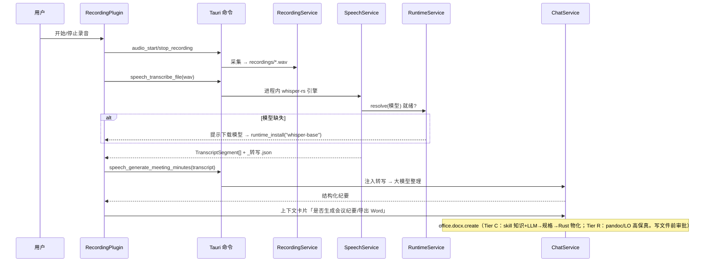
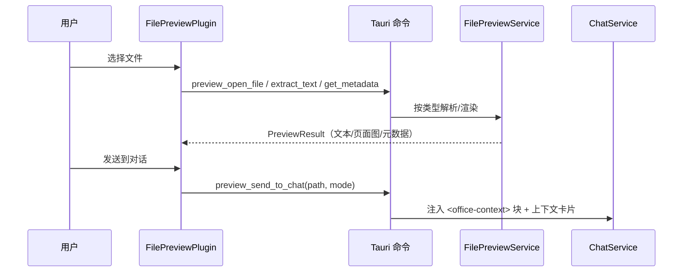

# Design — Office Agent（录音与文件预览）

## Overview

本设计在不改动 DeepAgent Studio 现有架构的前提下，新增两条「办公任务触发器」——录音与文件预览——并把它们的产物接回 `ChatService` 对话上下文。遵循现有分层：

```
React UI (apps/desktop/src)
  └─ ChatView 快捷入口 + 插件面板
        │  invoke()
        ▼
Tauri 命令层 (apps/desktop/src-tauri/src/lib.rs)
  └─ #[tauri::command] 薄封装 → AppState 持有的 Arc<Service>
        ▼
app-core 服务层 (crates/deepagent-app-core/src)
  └─ RecordingService / SpeechService / FilePreviewService / OfficeService / RuntimeService
        ▼
三层能力解析（每能力统一走解析器，详见「运行时管理与三层降级」）
  ├─ Tier R 托管运行时（按需下载到应用自有目录）：pdfium / pandoc / LibreOffice / 语音模型 / OCR
  └─ Tier C 代码兜底（永远可用）：
        ├─ 纯 Rust（cpal 采集、zip+quick-xml/calamine 解析、whisper-rs 进程内引擎、OOXML writer）
        └─ 文档生成 = 系统大模型(ChatService) + skill 知识 → 结构化规格 → Rust 物化
        ▼
AI 工具层 (deepagent-builtins) office.* / runtime.* / 经 ChatService 注入上下文
```

设计目标：**最小侵入**。新插件复用 `ChatView` 已有的 `TOOL_CARDS` + 标签页渲染分支；新命令复用 `invoke_handler!` + `AppState` 模式；新服务复用 `Arc<Service>` 持有与 `state.rt.block_on` 调用约定。

## 现有锚点（实测）

- **快捷入口**：`ChatView.tsx` 顶部 `export type PluginType = "none" | "files" | "chat" | "browser" | "terminal" | "project_map";` 与 `TOOL_CARDS` 数组；渲染分支在底部面板与右侧边栏两处 `... type === "xxx" && <XxxPlugin />`。
- **插件组件**：`apps/desktop/src/components/plugins/{FilesPlugin,SideChatPlugin,BrowserPlugin,TerminalPlugin}.tsx`，`ProjectMapPanel` 单独在 `components/project-map/`。
- **命令注册**：`lib.rs` 的 `AppState { ... terminal: Arc<TerminalService>, ... }`，在 `run()` 的 `.setup(|app| {...})` 内构造服务并 `app.manage(AppState{...})`，最后 `.invoke_handler(tauri::generate_handler![ ... run_terminal, terminal_cwd ])`。
- **同步命令调用异步**：`state.rt.block_on(async move { ... })`（见 `run_terminal`）。
- **服务范例**：`TerminalService::new(projects.clone(), workspace_root)`，命令 `run_terminal` / `terminal_cwd` 极薄。
- **DTO**：app-core `dto.rs` 定义并从 `lib.rs` re-export（如 `TerminalResultDto`、`ProjectMap*Dto`）。
- **资源发现**：`locate_builtin_skills_dir(resource_dir)` 用多候选路径（`resources/skills`、`skills`、`_up_/resources/skills`、根）适配各打包布局——运行时发现复用同一策略。
- **打包**：`tauri.conf.json` `bundle.resources` 现含 `resources/skills/**/*`（prebundle 脚本生成、gitignore）。
- **权限**：`capabilities/default.json` 已含 `dialog:allow-open`；麦克风走 webview 媒体 API 或原生采集（见下）。
- **审批/权限规则**：现有 `get_permission_rules` / `set_permission_rules` + `ApprovalDialog`，builtin 工具带风险级别参与审批。

## 组件设计

### 1. 前端

#### 1.1 ChatView 接线（Requirement 1）

```ts
// PluginType 扩展（追加，不改现有）
export type PluginType =
  | "none" | "files" | "chat" | "browser" | "terminal" | "project_map"
  | "recording" | "file_preview";

// TOOL_CARDS 追加两项
{ icon: ["fas", "microphone"], title: "recording",    desc: "recordingDesc",    type: "recording" },
{ icon: ["far", "file-lines"], title: "file_preview", desc: "filePreviewDesc",  type: "file_preview" },
```

在底部面板与右侧边栏的渲染分支各追加：

```tsx
{... type === "recording" && <RecordingPlugin />}
{... type === "file_preview" && <FilePreviewPlugin />}
```

i18n：在 `locales` 增加 `chatView.tools.recording` / `recordingDesc` / `file_preview` / `filePreviewDesc`（中英）。

#### 1.2 RecordingPlugin.tsx（Requirements 2, 5, 10）

状态机驱动的面板：

```ts
type RecordingState = "idle" | "recording" | "paused" | "transcribing" | "done" | "error";
interface RecordingSession { id; status; startedAt; durationMs; audioPath?; transcriptPath?; }
```

- 控制区：开始/暂停/继续/停止（按 state 启用）；录音中显示红点 + 计时器。
- 停止后：展示「转写为文字」「生成会议纪要」「导出 Word/Markdown」（导出在 Phase 3 前置灰）。
- 通过 `api.ts` 封装调用 `audio_*` / `speech_*` 命令；转写期间显示忙碌态；错误进入 `error` 态并显示信息。
- 完成后调用「发送到对话」生成上下文卡片（Requirement 10）。

#### 1.3 FilePreviewPlugin.tsx（Requirements 6, 7, 10）

- 顶部「选择文件」按钮 → `dialog` open；展示元数据条。
- 渲染器分发：文本/json/csv（前端渲染，csv 转表格）、图片（直接显示）、pdf（页面图片，缺运行时降级文本）、docx（文本）、xlsx（sheet + 前 N 行）、pptx（文本 + 缩略图）。
- 底部操作：「发送到对话」+「让 Agent 摘要/修改/转换/生成新文件」快捷指令。

#### 1.4 api.ts / types.ts

新增 invoke 封装与 DTO 镜像类型（`RecordingSession`、`TranscriptSegment`、`PreviewResult`、`OfficeContext`），与现有 `runTerminal` 等同模式。

### 2. Tauri 命令层（lib.rs）

`AppState` 追加三个服务字段：

```rust
recording: Arc<RecordingService>,
speech:    Arc<SpeechService>,
preview:   Arc<FilePreviewService>,
```

在 `setup` 内构造（speech 需要 resource_dir 定位 sidecar/模型；recording 需要 app_data_dir 下的 `recordings/`），并加入 `app.manage(AppState{...})`。命令薄封装并注册到 `invoke_handler!`：

```
audio_list_input_devices, audio_start_recording, audio_pause_recording,
audio_resume_recording, audio_stop_recording,
speech_transcribe_file, speech_transcribe_stream, speech_generate_meeting_minutes,
preview_open_file, preview_extract_text, preview_get_metadata,
preview_render_pages, preview_send_to_chat,
runtime_list, runtime_status, runtime_install, runtime_cancel, runtime_uninstall
```

长耗时（转写、渲染、运行时下载）用 `async fn` 命令或 `state.rt.block_on`，并对实时进度用 `app.emit("recording:progress" / "transcribe:progress" / "runtime:progress", ...)`（复用现有事件模式，如 skill-ai-review）。`AppState` 另加 `runtime: Arc<RuntimeService>` 字段，`speech` / `preview` / `office` 服务持有它做能力解析。

可选 native 模块 `src-tauri/src/audio.rs`、`src-tauri/src/file_preview.rs` 承载平台相关采集/渲染细节。

### 3. app-core 服务层

新增模块并从 `lib.rs` 导出，DTO 入 `dto.rs`：

- **`recording_service.rs`** — 管理 `RecordingSession` 生命周期、写 WAV 到 `recordings/`。采集优先用 `cpal`（纯 Rust 跨平台音频）；目标格式 16kHz 单声道 PCM WAV（用 `hound` 写）。
- **`speech_service.rs`** — 用 **`whisper-rs`（进程内引擎，静态链接 whisper.cpp）** 转写，无 sidecar 进程；模型文件从托管运行时目录加载（缺失则经 RuntimeService 触发下载）。解析为 `TranscriptSegment[]`，写 `_转写.json`；`generate_meeting_minutes` 委托注入的 `ChatService`。
- **`file_preview_service.rs`** — 元数据/文本提取/页面渲染分发。docx/xlsx/pptx 用纯 Rust（`zip` + `quick-xml`，xlsx 用 `calamine`）；PDF 文本用纯 Rust（`lopdf`/`pdf-extract`），页面渲染走 Tier R 的 pdfium（`pdfium-render`），缺失则降级文本。
- **`office_service.rs`** — `office.*` 工具后端，按三层解析（见下）。读取/基础生成走 Tier C 纯 Rust；生成走「skill 知识 + ChatService → 结构化规格 → Rust OOXML writer」；Tier R 可用时用 pandoc/LibreOffice 提升保真或处理旧格式。
- **`runtime_service.rs`** — 托管运行时的注册表、状态查询、下载+校验+解压安装、卸载，统一的能力解析入口（`resolve(capability) -> TierR(path) | TierC`）。

服务持有 `Arc<ChatService>` / `projects` / `Arc<RuntimeService>` 以接入对话、工作目录与运行时解析，遵循现有依赖注入习惯。

#### 3.1 RuntimeService 与三层解析（Requirements 9, 13）

```rust
struct RuntimeEntry {
    id: &'static str,            // "pdfium" | "pandoc" | "libreoffice" | "whisper-base" | "ocr" ...
    version: &'static str,
    // 各平台：下载 URL（HTTPS、固定可信源）、SHA-256、解压后目标子目录
    artifacts: HashMap<Platform, RuntimeArtifact>, // { url, sha256, dest_subdir }
    install: InstallKind,        // ArchiveExtract（zip/tar.xz 就地解压）默认；避免厂商安装器
}
enum Tier { R { root: PathBuf }, C }
// 能力 → 运行时依赖映射；resolve 先查 Tier R 是否就绪，否则 Tier C
fn resolve(&self, cap: Capability) -> Tier;
```

- **安装根目录**：优先应用可执行文件同级的 `runtimes/`（应用自有、随用户安装于可写位置时即可写）；若该位置只读（如 `Program Files`），回退到 `app_data_dir()/runtimes/`。两者都**不写系统目录、不进 PATH、不需管理员**，且可一键卸载。
- **下载安装**：`runtime_install(id)` → 选平台 artifact → 流式下载（发 `runtime:progress`）→ 校验 SHA-256（失败即删）→ 就地解压到目标子目录 → 标记就绪。可 `runtime_cancel`。
- **能力解析**：每个 `office.*` / 预览 / 语音操作先 `resolve(cap)`；命中 Tier R 用运行时，否则 Tier C。上层接口对层级无感。

### 4. AI 工具层（deepagent-builtins，Phase 3+）

新增 `office_tools.rs`，按现有 builtin 工具模式（名称 + JSON schema + RiskLevel + 权限）注册 `office.docx.*` / `office.xlsx.*` / `office.pptx.*` / `office.pdf.render` / `office.file.preview`。通过一个 `OfficeBackend` trait 桥接到 app-core `OfficeService`（与 codegraph 工具的 backend-trait 桥接同构）。工具对三层解析无感——`OfficeService` 内部决定走 Tier R 还是 Tier C。风险级别：read/preview = 低；create/export = 中；overwrite/delete = 高。

运行时管理面向 UI 走 `runtime_*` 命令（见下），不作为模型工具；模型不能自行触发下载执行。

## 数据流

### 会议纪要（Requirements 4, 5, 10）



### 文件预览 → 上下文



## 运行时管理与三层降级（Requirements 9, 13）

**安装包不含任何重型运行时**。安装包只带：应用本体 + 现有 `resources/skills/**/*` + Tier C 所需纯 Rust 能力（含静态链接的 `whisper-rs` 引擎，但不含模型）。

托管运行时目录（应用自有，按需填充）：

```
<应用安装目录>/runtimes/        # 首选：与可执行文件同级（按用户安装于可写位置时可写）
  speech/models/ggml-base.bin   # 下载得到
  pdfium/                       # 下载得到（PDF 页面渲染）
  pandoc/                       # 下载得到（md↔docx 高保真）
  libreoffice/                  # 下载得到（旧格式/高保真转换）
  ocr/                          # 下载得到（视觉/OCR）
# 若安装目录只读（如 Program Files）→ 回退到 app_data_dir()/runtimes/
```

运行时注册表（每条含各平台 URL + SHA-256 + 目标子目录），下载安装流程：

```
runtime_install(id)
  → 选当前平台 artifact（HTTPS 固定可信源）
  → 流式下载，emit runtime:progress（可 runtime_cancel）
  → 校验 SHA-256（失败即删，绝不安装未校验产物）
  → 就地解压便携包到目标子目录（不跑厂商安装器、不进 PATH、不需管理员）
  → 标记就绪；后续 resolve(cap) 命中 Tier R
```

- 运行时定位 `locate_runtime_dir(install_root, sub)` 复用 `locate_builtin_skills_dir` 的多候选 + 缺失诊断策略。
- `tauri.conf.json` `bundle.resources` 保留现有 `resources/skills/**/*`；不新增重型运行时打包条目。
- **许可证**：pandoc/LibreOffice 等 GPL/LGPL 组件以**独立可执行/便携包子进程**方式调用（非静态链接），随附各自 license 文本与来源说明；下载分发亦附出处。

### 能力 → Tier 映射

| 能力 | Tier R（有运行时） | Tier C（兜底，永远可用） |
|---|---|---|
| docx/xlsx/pptx 读取 | 纯 Rust 即可，无需运行时 | 纯 Rust（zip+xml / calamine） |
| docx/xlsx/pptx 生成 | pandoc/LibreOffice 高保真、或运行 skill 脚本 | **skill 知识 + ChatService → 结构化规格 → Rust OOXML writer** |
| PDF 文本提取 | — | 纯 Rust（lopdf/pdf-extract） |
| PDF 页面渲染 | pdfium 转图片 | 仅文本/基础位图 + 提示安装 pdfium |
| 旧格式 .doc/.xls/.ppt | LibreOffice 转换 | 提示安装 LibreOffice（无可靠纯 Rust 兜底） |
| 语音转写 | whisper-rs + 已下载模型 | 引擎是代码、**模型须下载一次**（无纯代码兜底） |
| OCR/视觉 | OCR 运行时 | 降级/提示安装 |

## 权限与审批（Requirement 11）

| 操作 | 风险 | 处理 |
|---|---|---|
| 预览 / 提取文本 / 摘要 | 低 | 直接执行 |
| 新建 / 导出 / 存副本 | 中 | 按现有策略放行 |
| 覆盖 / 删除 / 发邮件 / 打印 | 高 | 强制审批卡 |
| 麦克风采集 | — | 首用申请系统权限 + 录音中显著提示 |
| 运行时下载安装（`runtime_install`） | 高 | 用户显式同意才下载+执行/解压；HTTPS + SHA-256 校验通过方可安装；进度可见可取消 |

- `office.*` 工具携带 `RiskLevel`，接入 `get/set_permission_rules` 与 `ApprovalDialog`。
- 录音权限：webview `getUserMedia` 触发系统授权，或原生 `cpal` 设备打开失败时返回明确错误。`capabilities/default.json` 按需增加媒体相关权限。
- 审批级别与「工作模式」解耦：办公模式不降低 office 工具的风险判定。

## 错误处理

- 录音设备/权限失败 → `RecordingSession.status = error` + 可读信息。
- 运行时/模型缺失 → 命令返回结构化错误（缺失项 id + 体积），UI 提示下载（`runtime_install`）或回落 Tier C。
- 运行时下载失败 / SHA-256 不符 → 删除临时产物、报错、可重试；绝不安装未校验产物。
- 文档解析失败 → 预览面板显示提示，`preview_*` 返回 `Result::Err` 字符串（与现有命令一致 `.map_err(|e| e.to_string())`）。
- 所有外部进程调用设超时与输出大小上限，避免卡死/内存膨胀。

## 测试策略

- **app-core 单测**：RecordingService 状态机迁移；SpeechService 对 whisper 输出的解析（固定样例，不真跑引擎）；FilePreviewService 对样例 docx/xlsx/pptx/csv 的文本提取与元数据；OfficeService 三层解析选择逻辑 + 纯 Rust 生成往返；RuntimeService 注册表解析、SHA-256 校验、安装根目录回退（可写 vs 只读）。
- **资源发现单测**：`locate_runtime_dir` 多布局，镜像现有 `locate_builtin_skills_dir` 测试。
- **前端**：类型检查通过；插件渲染分支与状态机的轻量交互测试（若现有测试框架支持）。
- **降级路径**：运行时/模型缺失时回落 Tier C（或引导下载）而非 panic 的用例。
- 不真实录音/不真跑重型运行时/不真实下载于 CI；用样例、mock 与本地 fixture 校验和。

## 分期映射

| Phase | 范围 | 主要需求 |
|---|---|---|
| 1 | 右侧入口 + 两个插件 UI + 文件选择器 + 基础文本/图片预览 + PDF 文本降级 | R1, R2(UI), R6, R7(1-8 的 Tier C), R13(预览兜底) |
| 2 | 录音采集 + whisper-rs 进程内引擎 + RuntimeService（下载/校验/安装到应用自有目录）+ 模型按需下载 + 转写 + 会议纪要 Markdown | R3, R4, R5(1-4 部分), R9, R11(7) |
| 3 | OfficeService 三层解析 + office.* 工具 + Tier C 文档生成（skill+LLM→规格→Rust 物化）+ docx 纪要导出 + xlsx/pptx 预览 + 预览结果送上下文 | R5(docx), R7(高保真), R8, R10, R13(生成兜底) |
| 4 | Tier R 高保真补全（pdfium/pandoc/LibreOffice 接入 + 旧格式）+ 审批完善 + 跨平台回归 | R7(4 渲染), R9(全运行时), R11, R12 |

> 注：RuntimeService（按需下载框架）作为 Phase 2 的基础设施先落地，Phase 3/4 的各运行时依次接入它。
