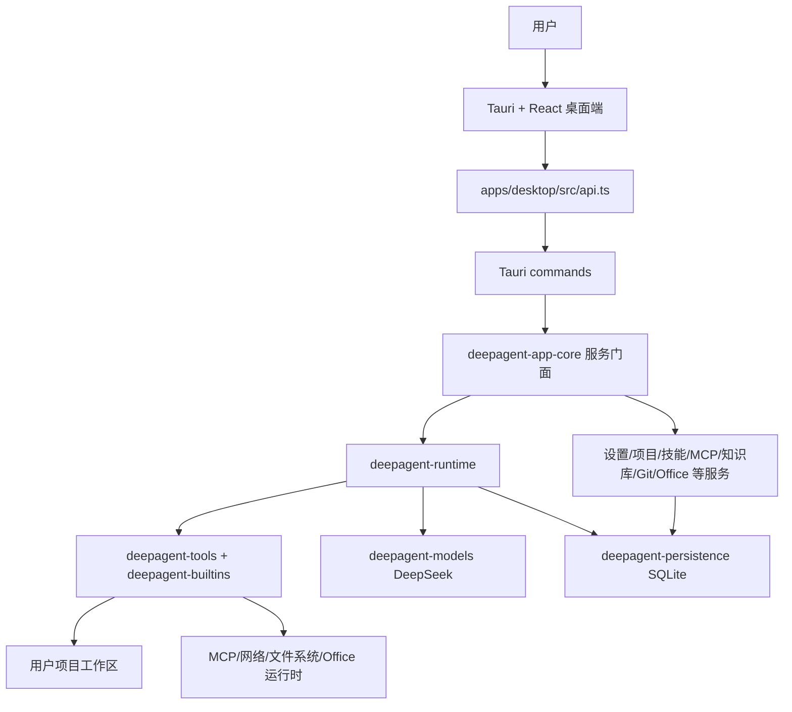

# 项目定位与技术栈

## 1. 项目定位

DeepAgent Studio 是一个以 DeepSeek 为模型底座的 Agent 运行时平台，并在其上构建了 Tauri + React 桌面 IDE。它不只是聊天壳，而是一个围绕“可验证、可回放、可扩展、可审计”设计的 Agent 操作系统。

核心能力包括：

- 会话事件溯源：所有会话、消息、工具调用、用量等都以 append-only 事件写入 SQLite。
- 可回放 UI：桌面端不直接相信内存状态，而是从事件日志重建 timeline 和 conversation。
- Agent 运行循环：`THINK -> EXECUTE -> OBSERVE`，并支持工具、审批、Hook、自愈验证、取消、token 用量记录。
- 上下文工程：系统提示组装、token 预算、工作区扫描、记忆注入、技能目录提醒。
- 工具系统：文件、bash、todo、web、知识库、项目地图、Office、MCP、Git、子代理等能力统一注册。
- 安全与权限：审批策略、沙箱模式、权限规则、Hook 生命周期、高风险工具分类。
- 技能系统：`SKILL.md` 发现、安装、市场搜索、静态扫描、AI 安全审查、被动/主动激活。
- 桌面生产力面板：项目管理、聊天、技能、知识库、插件、Git workbench、项目地图、终端、文件预览、录音、语音转写、Office 文档生成。



## 2. 技术栈与运行环境

| 层级 | 技术 | 用途 |
| --- | --- | --- |
| 后端内核 | Rust 1.80+, Cargo workspace | Agent runtime、事件存储、服务层、工具系统 |
| 桌面壳 | Tauri v2 | 原生窗口、命令桥、系统资源、Updater、Dialog |
| 前端 | React 18 + TypeScript + Vite | 桌面 UI、聊天流、设置页、插件面板 |
| 样式 | Tailwind + `styles.css` | 暗色 Codex 风格界面 |
| 数据 | SQLite via `rusqlite` bundled | 会话事件、文档存储、配置、成本、项目状态 |
| 模型 | DeepSeek HTTP/SSE | 聊天、reasoning、模型发现、余额查询 |
| 解析 | tree-sitter | 代码图谱索引 |
| 文档/Office | zip、calamine、pdf-extract、rust_xlsxwriter、pdfium 可选 | 文档预览、读取、生成、PDF 渲染 |
| 音频/语音 | cpal、hound、whisper-rs 可选 | 录音、转写、会议纪要 |

快速命令：

```bash
# 后端测试
cargo test --workspace --offline

# 无头 CLI 演示
cargo run -p deepagent-cli

# 桌面端开发
cd apps/desktop
pnpm install
pnpm tauri dev

# 前端浏览器预览，仅 mock，不能使用原生能力
cd apps/desktop
pnpm dev

# 前端构建
cd apps/desktop
pnpm build
```

