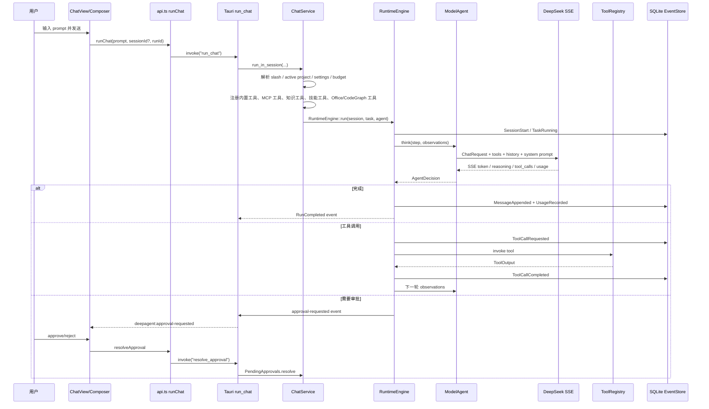
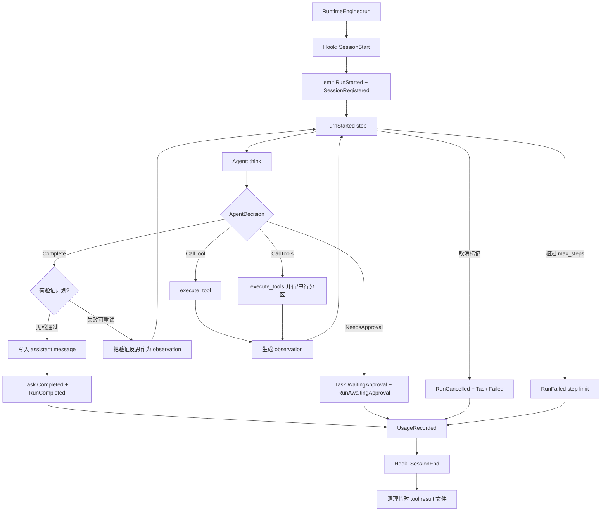
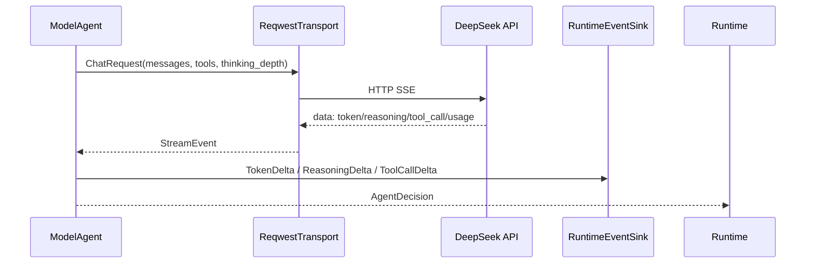

# 运行循环与模型

## 10. 聊天运行全流程

用户发送消息后，前端 `runChat` 调用 Tauri `run_chat`。后端不会阻塞 UI：运行在后台任务中，运行事件通过窗口事件持续推送给前端。

### 10.1 `ChatService` 的运行前组装

`ChatService` 会在每次运行前做这些事情：

1. 找到 effective root：优先 active project，否则启动 workspace。
2. 检查成本预算：`CostService::check_budget`。
3. 处理 slash 命令：如 `/plan`、`/execute`、`/model`、`/thinking`、`/help`，能在不调用模型的情况下写入会话。
4. 加载 settings：模型、thinking depth、approval policy、sandbox mode、verification policy、web search、tool search、permission rules、hooks。
5. 构建 `ToolRegistry`：
   - 文件工具：read/write/edit/multi_edit/list/glob/grep。
   - bash 工具：受 allowlist、权限、Hook 和审批约束。
   - todo/task/subagent 工具。
   - web_fetch/web_search 工具，受 provider 设置影响。
   - knowledge_search/knowledge_write。
   - codegraph/project_map 查询工具。
   - office_read/create 文档工具。
   - skill 激活工具。
   - MCP 远程工具，按 server namespace 注册。
6. 构建 system prompt：核心系统提示、工作区规则、知识被动块、技能目录、todo snapshot、plan mode reminder 等。
7. 构建 `ModelAgent`：设置 history、thinking depth、event sink。
8. 构建 `RuntimeEngine`：设置 hooks、approvals、cancel flag、verification plan、tool result budget、decorator。
9. 运行结束后记录 token 成本、自动知识捕获、刷新 UI 事件。

### 10.2 运行循环细节

### 10.3 并行工具调用规则

`RuntimeEngine::execute_tools` 支持同一模型 turn 内的多工具调用：

- 只有只读且并发安全的工具会并行执行，例如读取、搜索、fetch 等。
- 写文件、编辑、bash、高风险或需审批工具按顺序执行。
- 事件写入仍按模型返回顺序记录，确保 append-only event log 可预测、可回放。
- 所有并行工具会先 emit `ToolStarted`，让 UI 立即显示多个 running 工具卡。

## 13. 模型层与 DeepSeek

`deepagent-models` 负责与 DeepSeek 交互：

- `ChatRequest` / wire DTO：构造请求体。
- `ReqwestTransport`：HTTP transport。
- `SSE`/`stream`：解析流式 token、reasoning、tool calls。
- `ThinkingDepth`：控制 reasoning depth。
- `discovery`：模型发现。
- `balance`：余额查询。

运行时中的 `ModelAgent` 会：

1. 接收 system prompt、history、工具定义和 thinking depth。
2. 发起流式请求。
3. 将 token/reasoning/tool_call/usage 转成 runtime events。
4. 将模型输出归约为 `AgentDecision::Complete`、`CallTool`、`CallTools` 或 `NeedsApproval`。

