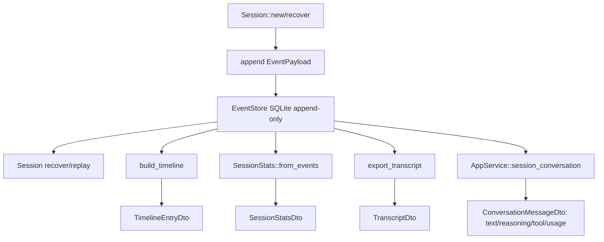
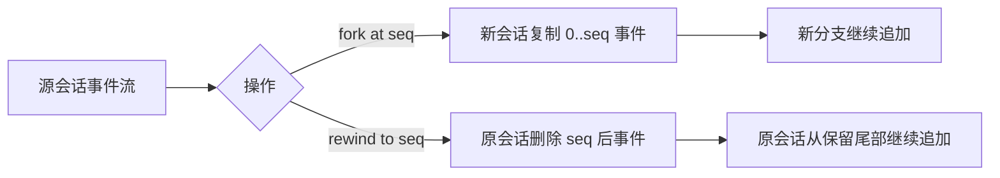
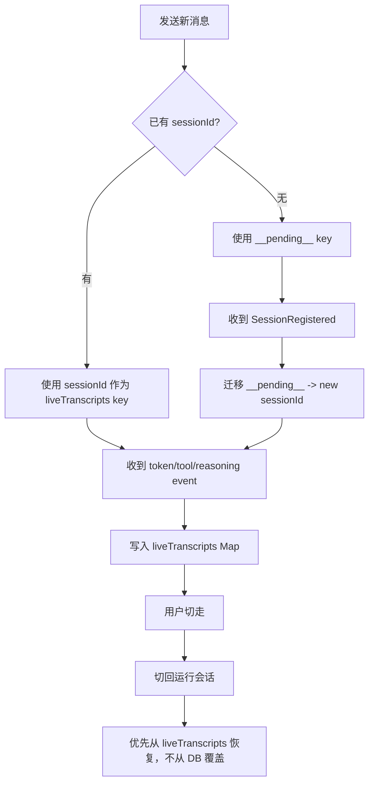

# 会话与数据

## 9. 会话与事件模型

系统的会话不是“内存聊天数组”，而是一条事件流。`deepagent-session` 负责把事件折叠为状态，`deepagent-observation` 负责把事件转为 timeline/stats/transcript，`AppService` 再把它们转为 DTO。



`AppService::session_conversation` 的重建规则：

- `MessageAppended(User)` 生成用户消息，并清空当前工具卡位置索引。
- `MessageAppended(Assistant)` 把 reasoning 和 text 放入当前 assistant turn。
- `ToolCallRequested` 确保有一个 assistant turn，并插入 running 工具卡。
- `ToolCallCompleted` 用 `call_id` 找到之前的工具卡，更新状态、耗时、摘要和原始输出。
- `UsageRecorded` 附加到当前 assistant turn 的 footer。
- 空 assistant turn 会在最后过滤掉，除非它包含工具卡。

### 9.1 会话状态流

```mermaid
stateDiagram-v2
    [*] --> Created
    Created --> Running: Task queued -> running
    Running --> WaitingApproval: AgentDecision::NeedsApproval
    WaitingApproval --> Running: 用户批准后继续
    WaitingApproval --> Failed: 用户拒绝或策略拒绝
    Running --> Completed: AgentDecision::Complete + 验证通过/放弃
    Running --> Failed: step limit / 工具错误不可恢复
    Running --> Cancelled: stop_chat 设置取消标记
    Completed --> Recovered: recover/replay
    Failed --> Recovered: recover/replay
    Cancelled --> Recovered: recover/replay
    Recovered --> Running: 继续会话
```

### 9.2 fork 与 rewind



- `fork_session` 是非破坏性分支，返回新 session id。
- `rewind_session` 是破坏性回滚，返回删除事件数量。
- `export_transcript` 支持 Markdown/JSON。

## 25. 前端状态与流式事件

`App.tsx` 是桌面端状态中心，维护：

- `sessions`：侧栏会话。
- `projects`：项目列表。
- `activeProjectPath`：当前项目。
- `activeId`：当前会话。
- `detail`：当前会话详情。
- `view`：`start | chat | skills | knowledge | plugins | automation | settings`。
- `messages`：当前展示的聊天消息。
- `approvals`：审批 FIFO 队列。
- `runningSessionIds`：正在运行的 session 集合。
- `planMode`：当前 session Plan mode。
- `activePendingRunKey`：新会话尚未注册时的运行 key。
- `liveTranscripts`：跨导航保存进行中 transcript。
- `navState`：前进/后退历史。

### 25.1 Live transcript 机制



这保证运行中的会话即使切换视图，也不会因为 DB replay 滞后而丢失实时 token 或工具卡。

## 27. 数据持久化

`deepagent-persistence` 的核心职责：

- 数据库打开和迁移。
- `EventStore`：会话事件 append-only 存储。
- `DocumentStore`：设置、MCP、归档、项目状态等 JSON 文档。
- `CostStore`：成本记录。

数据原则：

- 会话事实只从事件流恢复。
- 设置和轻量状态存 DocumentStore。
- 密钥不存 DB，存 OS keychain 或测试用 Memory/EnvSecretStore。
- 新功能应优先新增文档 collection 或事件类型，不要把 UI 临时态混入核心事件。

