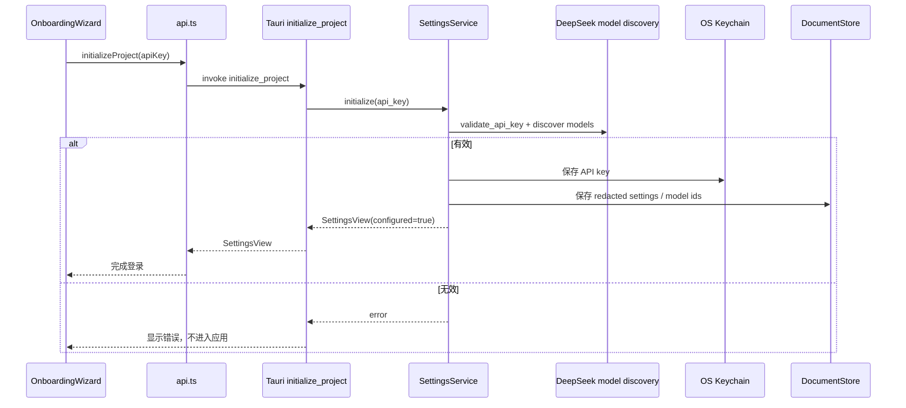
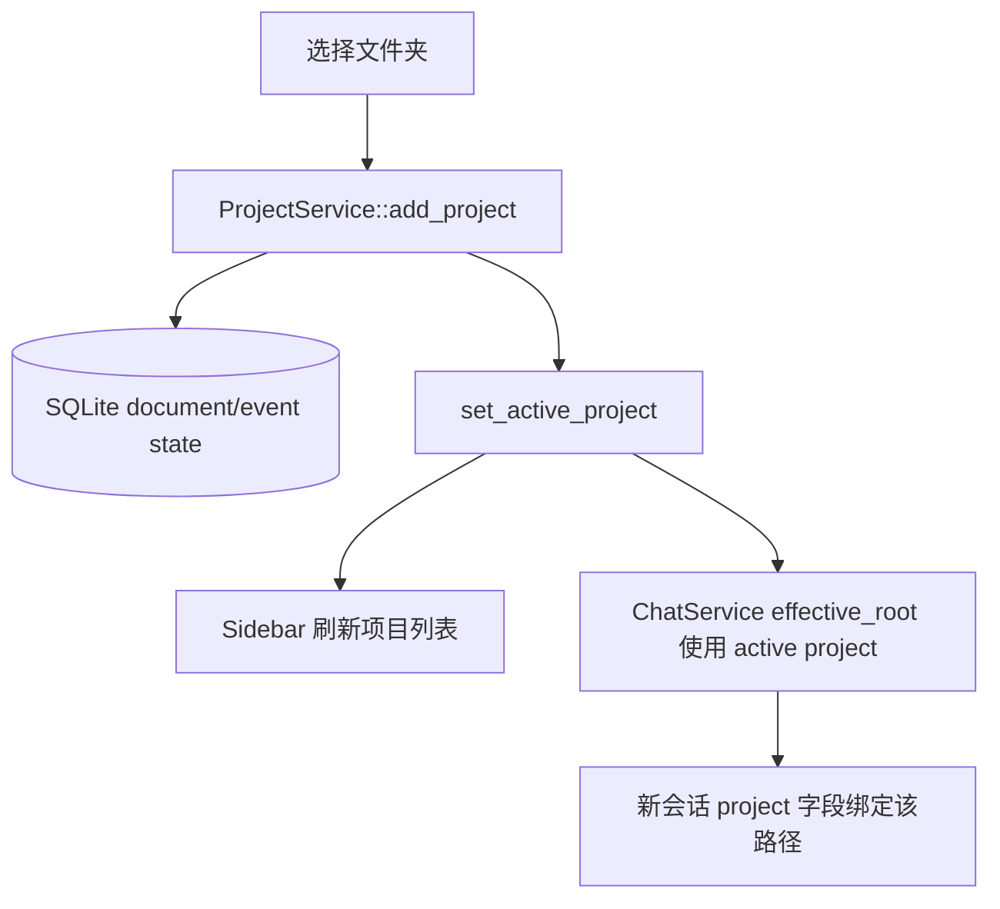

# 桌面端与项目

## 6. 桌面端应用结构

`apps/desktop` 是独立的 Tauri workspace。前端由 Vite 构建，Tauri 配置在 `src-tauri/tauri.conf.json`。

### 6.1 桌面端配置

关键配置：

- 产品名：`DeepAgent Studio`
- 版本：`0.0.4`
- bundle identifier：`com.deepagent.studio`
- dev server：`http://localhost:1420`
- 主窗口：`1280x800`，最小 `900x600`，暗色主题，无系统装饰栏。
- bundle resources：`resources/skills/**/*`
- updater：通过 `gh-proxy.com` 加速 GitHub release 下载。
- Tauri crate features：启用 `deepagent-app-core` 的 `keychain`、`web`、`audio`、`runtimes`。

### 6.2 前端主要文件

| 文件 | 作用 |
| --- | --- |
| `src/main.tsx` | React 入口 |
| `src/App.tsx` | 顶层状态、导航、会话加载、项目加载、运行流事件处理 |
| `src/api.ts` | 所有 Tauri invoke 封装，浏览器模式下提供 mock/fallback |
| `src/types.ts` | 与 Rust DTO 对齐的 TypeScript 类型 |
| `src/i18n.ts` + `src/locales/*.json` | 多语言资源 |
| `src/styles.css` | 全局样式 |
| `src/update.ts` | Tauri updater 检查与下载 |

### 6.3 前端视图

| 视图/组件 | 功能 |
| --- | --- |
| `OnboardingWizard` | 首次连接 DeepSeek API Key，成功后写入 OS keychain 并进入应用 |
| `TitleBar` | 无边框窗口顶部栏、侧栏开关、前进后退 |
| `Sidebar` | 项目列表、会话列表、置顶、归档、项目菜单、入口导航 |
| `StartView` | 新任务起点、项目入口、项目地图快捷入口 |
| `ChatView` | 聊天主界面、消息渲染、工具卡、reasoning、用量、审批、fork/rewind/export |
| `Composer` | 输入框、发送、停止、Plan mode、thinking depth、approval policy 控制 |
| `ToolCallCard` | 工具调用统一展示，含 web/office/skill/project-map 等专用摘要 |
| `MarkdownText` | Markdown/GFM/math/KaTeX/代码高亮 |
| `CommandPalette` | 命令面板 |
| `SearchModal` | 会话搜索 |
| `SkillsView` | 已安装技能、技能市场、安装弹窗 |
| `KnowledgeView` + `KnowledgeGraph` | 知识条目列表、搜索、图谱、草稿接受/丢弃 |
| `PluginsView` | 插件市场/本地插件管理 UI |
| `AutomationView` | 自动化入口占位/展示 |
| `SettingsView` + `SettingsSidebar` | 设置页框架 |
| `ProjectMapPanel` | 原生代码图谱浏览、搜索、邻居、影响分析、刷新 |
| `ProjectMapDebugView` | 项目地图调试开关和调试视图 |
| `GitWorkbench` | Git 改动、历史、diff 工作台 |
| `TerminalPlugin` | 终端命令面板 |
| `FilePreviewPlugin` | 文件元数据、文本提取、图片/PDF/Office 预览 |
| `RecordingPlugin` | 音频录制、暂停、恢复、停止、转写和会议纪要 |
| `BrowserPlugin` | 简易内嵌浏览器插件 |
| `SideChatPlugin` | 侧栏聊天插件 |
| `FilesPlugin` | 文件插件入口 |

### 6.4 设置页分类

| 设置组件 | 当前职责 |
| --- | --- |
| `GeneralSettings` | 常规偏好、编辑器、Shell、语言等 UI 项 |
| `AppearanceSettings` | 主题、外观选项 |
| `PersonalizeSettings` | 个性化偏好 |
| `ConnectionsSettings` | 外部连接入口 |
| `ConfigSettings` | 模型、技能目录、技能 AI 审查、运行时资源管理 |
| `MCPSettings` | MCP server 增删改查、启停 |
| `HooksSettings` | `hooks.json` 编辑与校验 |
| `GitSettings` | Git 相关选项入口 |
| `BrowserSettings` | 浏览器相关选项入口 |
| `ComputerSettings` | 计算机/权限相关选项入口 |
| `EnvSettings` | 环境变量管理 UI |
| `ArchiveSettings` | 归档会话管理 |
| `WorktreeSettings` | worktree 设置入口 |
| `ShortcutsSettings` | 快捷键说明/配置入口 |
| `ProjectMapDebugSettings` | 项目地图调试开关 |

## 14. 设置、登录与 Key 管理

首次进入应用时，`OnboardingWizard` 调用 `initializeProject(apiKey)`：

设计要点：

- API Key 不落盘明文，启用 `keychain` feature 后使用系统钥匙串。
- `get_settings` 返回 redacted view。
- `clear_api_key` 只清除 key，保留部分 UI/目录配置。
- `refresh_models` 使用已存 key 重新拉取模型列表。
- `get_balance` 使用已存 key 查询账户余额。

## 15. 项目与工作区管理

项目在此系统中等价于一个本地文件夹。`ProjectService` 将项目路径、显示名、active 状态、置顶等写入数据库。

功能：

- 添加项目：`add_project(path)`。
- 激活项目：`set_active_project(path)`。
- 移除项目：`remove_project(path)`。
- 置顶项目：`set_project_pinned(path, pinned)`。
- 重命名显示名：`rename_project(path, name)`。
- 打开文件管理器：`open_project_in_file_manager(path)`。
- 会话列表过滤：隐藏已归档会话；如果会话绑定的项目已不在注册项目列表中，也会过滤。

## 26. 浏览器预览与桌面运行差异

`api.ts` 的 `getInvoke()` 会检测 `window.__TAURI_INTERNALS__`：

- 在 Tauri 中：动态 import `@tauri-apps/api/core` 并调用后端命令。
- 在普通浏览器中：返回 null，并使用 mock 或抛出“需要桌面 app”的错误。

因此：

- `pnpm dev` 适合 UI 样式和组件预览。
- `pnpm tauri dev` 才能使用 keychain、文件夹选择、真实聊天、MCP、录音、文件预览、Git 等原生能力。

