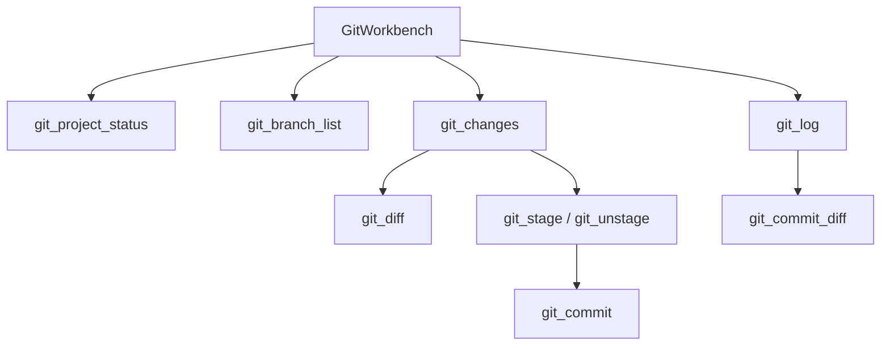

# Git 工作台

## 20. Git 工作台

`GitService` 是 UI-facing Git 边界，前端不应直接发 shell 命令。

功能：

- `git_project_status`：判断是否 git repo，返回 branch、dirty 等。
- `git_projects_status`：批量查询所有项目或指定列表。
- `git_branch_list`：列出本地/远程 branch，标记 current、upstream、commit、worktree。
- `git_changes`：读取 `status --porcelain=v1 -z` 和 `diff --numstat HEAD --`，分类并统计增删。
- `git_diff`：读取单文件 diff，最大 `96_000` bytes，超出截断。
- `git_log`：读取 commit log 和 numstat，默认 200，范围 1..1000。
- `git_commit_diff`：查看某 commit 中单文件 diff。
- `git_stage`：`git add -- <files>`。
- `git_unstage`：`git restore --staged -- <files>`。
- `git_commit`：提交 staged changes。
- `git_worktrees`：列出 worktree。

非 git 仓库不会抛 UI 级错误，而是返回 `is_repo=false` 或空列表，方便隐藏 Git affordance。

