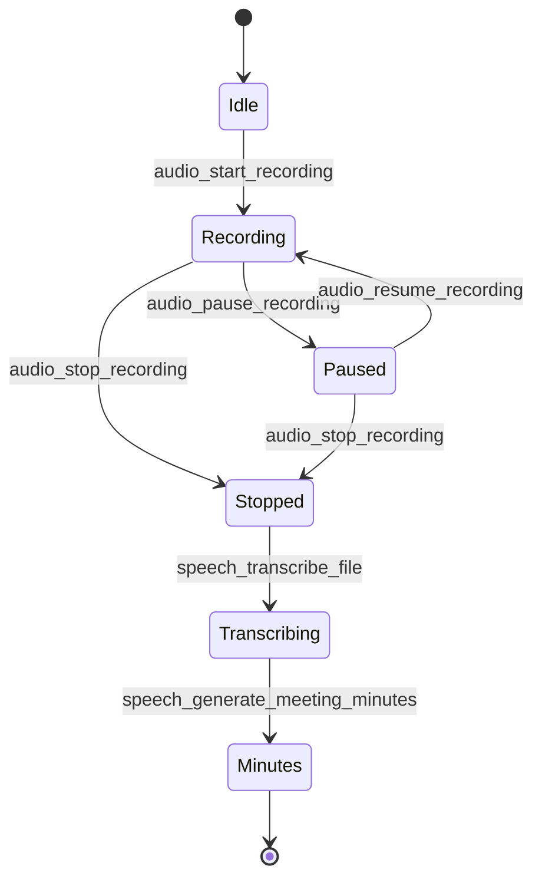

# 预览、Office 与语音

## 23. 文件预览、Office、录音与语音

这些能力属于 office-agent / daily office mode 方向。

### 23.1 文件预览

`FilePreviewService` 提供：

- `preview_get_metadata`
- `preview_open_file`
- `preview_extract_text`
- `preview_read_data_url`
- `preview_render_pages`

支持文本、图片 data URL、PDF 文本/页面渲染、Office 文档基础提取。

### 23.2 OfficeService

`OfficeService` 提供：

- `office_read_text(path)`：读取 docx/pptx/xlsx/pdf 等文本。
- `office_create_docx_from_markdown(markdown, title, outPath)`：Markdown 生成 docx。
- `office_export_minutes_docx(markdown)`：导出会议纪要 docx。

Agent 工具侧还暴露 `office_read`、`office_create_docx`、`office_create_xlsx`。

### 23.3 RuntimeService

管理可下载/安装的外部运行时资源，例如 pdfium、pandoc、whisper 等：

- `runtime_list`
- `runtime_status`
- `runtime_install`
- `runtime_cancel`
- `runtime_uninstall`

下载过程可通过 `RuntimeProgressDto` 推送进度。

### 23.4 RecordingService 与 SpeechService

录音生命周期：

语音能力：

- `speech_transcribe_file(wavPath)`：返回 `TranscriptSegmentDto[]`。
- `speech_model_installed`：检查模型资源。
- `speech_engine_installed`：检查引擎。
- `speech_generate_meeting_minutes(transcript)`：生成会议纪要。

