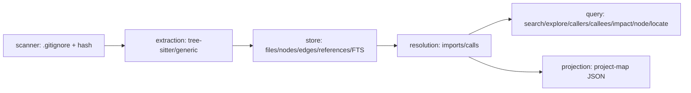
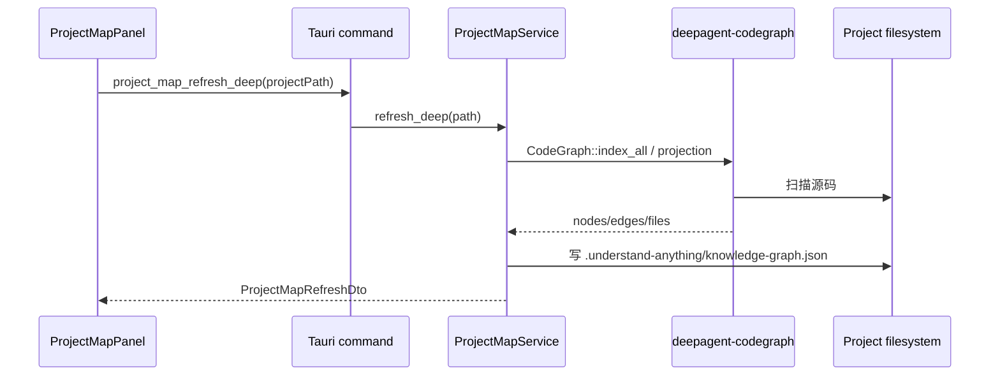

# 代码图谱与项目地图

## 19. 项目地图与代码图谱

项目中存在两套相关能力：

- `deepagent-codegraph`：原生、AI 友好的 rich graph，SQLite + FTS5，支持精确查询。
- `ProjectMapService`：读取/生成 `.understand-anything/knowledge-graph.json`，供桌面人类导航。

### 19.1 codegraph pipeline

语言覆盖：

- tree-sitter grammar：Rust、TypeScript/JavaScript、Python、Go，以及 Java、C#、C、C++、Ruby、PHP、Swift、Kotlin、Scala、Dart、Lua、Shell、CSS、HTML。
- generic extractor：Elixir、Haskell、R、Julia、SQL、XML、Vue、Svelte。
- 路由识别：Axum/Actix、Express、FastAPI、Django。

### 19.2 ProjectMapService 功能

| 方法/命令 | 说明 |
| --- | --- |
| `project_map_status` | 返回图谱是否存在、节点数、边数、文件数、更新时间、错误 |
| `project_map_overview` | 返回项目描述、语言、框架、复杂节点 |
| `project_map_search` | 按名称、路径、summary、tag、node type 搜索 |
| `project_map_node` | 获取节点详情 |
| `project_map_neighbors` | 分组返回 imports、imported_by、calls、called_by、related |
| `project_map_graph` | 返回局部图节点和边 |
| `project_map_impact` | 影响分析，区分 direct/indirect |
| `project_map_refresh_deep` | 重新索引并生成投影图 |

