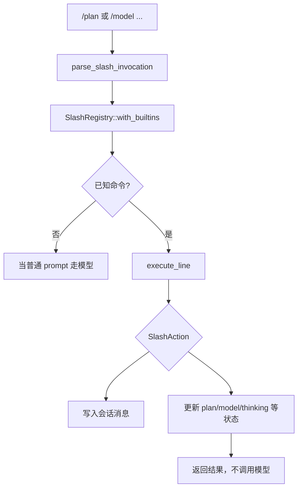

# Tauri 与 Slash 命令

## 7. Tauri 命令总表

`apps/desktop/src-tauri/src/lib.rs` 中 `tauri::generate_handler!` 注册的命令是前端能调用的完整后端能力边界。命令大多是薄包装，实际逻辑在 `deepagent-app-core` 服务中。

| 分组 | 命令 |
| --- | --- |
| 会话与视图 | `list_sessions`, `session_detail`, `session_conversation`, `set_session_pinned`, `commands`, `compute_diff`, `fork_session`, `rewind_session`, `export_transcript` |
| 初始化与设置 | `initialize_project`, `get_settings`, `refresh_models`, `get_balance`, `clear_api_key`, `set_chat_model`, `set_thinking_depth`, `get_approval_policy`, `set_approval_policy`, `get_sandbox_mode`, `set_sandbox_mode`, `get_verification_policy`, `set_verification_policy` |
| 工具搜索与 Web | `get_tool_search_mode`, `set_tool_search_mode`, `get_tool_search_threshold`, `set_tool_search_threshold`, `get_web_search_settings`, `set_web_search_settings` |
| 技能本地管理 | `list_skills`, `reload_skills`, `install_skill`, `install_skill_from_zip`, `uninstall_skill`, `preview_skill_activation`, `activate_skill` |
| 技能市场 | `skill_market_search`, `skill_market_test_key`, `skill_market_get_api_key`, `skill_market_set_api_key`, `skill_market_clear_api_key`, `skill_market_scan`, `skill_market_ai_review`, `skill_market_install`, `skill_market_cancel` |
| 技能运行设置 | `get_skill_catalog_enabled`, `set_skill_catalog_enabled`, `get_skill_catalog_char_budget`, `set_skill_catalog_char_budget`, `get_skill_install_ai_review_enabled`, `set_skill_install_ai_review_enabled`, `get_skill_install_ai_review_model`, `set_skill_install_ai_review_model` |
| 知识库 | `kb_list`, `kb_search`, `kb_get`, `kb_save`, `kb_delete`, `kb_reload`, `kb_set_passive`, `kb_passive_enabled`, `kb_list_drafts`, `kb_accept_draft`, `kb_discard_draft`, `kb_set_auto_capture`, `kb_auto_capture_enabled` |
| 成本与诊断 | `get_cost_summary`, `set_budget`, `run_doctor` |
| 聊天运行 | `run_chat`, `resolve_approval`, `stop_chat`, `get_plan_mode`, `set_plan_mode` |
| MCP 与权限 | `list_mcp_servers`, `save_mcp_server`, `remove_mcp_server`, `set_mcp_server_enabled`, `get_permission_rules`, `set_permission_rules`, `get_hooks_json`, `set_hooks_json` |
| 工作区/项目 | `workspace_info`, `list_projects`, `active_project`, `add_project`, `set_active_project`, `remove_project`, `set_project_pinned`, `rename_project`, `open_project_in_file_manager` |
| 项目地图 | `project_map_status`, `project_map_overview`, `project_map_search`, `project_map_node`, `project_map_neighbors`, `project_map_graph`, `project_map_impact`, `project_map_refresh_deep` |
| 归档 | `archive_project_conversations`, `archive_conversation`, `archive_all_conversations`, `list_archived_conversations`, `unarchive_conversation`, `delete_archived_conversation`, `delete_all_archived_conversations` |
| 终端 | `run_terminal`, `terminal_cwd` |
| Git | `git_project_status`, `git_projects_status`, `git_branch_list`, `git_changes`, `git_diff`, `git_log`, `git_commit_diff`, `git_stage`, `git_unstage`, `git_commit`, `git_worktrees` |
| 文件预览 | `preview_get_metadata`, `preview_extract_text`, `preview_open_file`, `preview_read_data_url`, `preview_render_pages` |
| 录音 | `audio_list_input_devices`, `audio_start_recording`, `audio_pause_recording`, `audio_resume_recording`, `audio_stop_recording` |
| 运行时资源 | `runtime_list`, `runtime_status`, `runtime_install`, `runtime_cancel`, `runtime_uninstall` |
| 语音 | `speech_transcribe_file`, `speech_model_installed`, `speech_engine_installed`, `speech_generate_meeting_minutes` |
| Office | `office_read_text`, `office_create_docx_from_markdown`, `office_export_minutes_docx` |

## 28. 命令面板与 slash 命令

命令面板由 `AppService::commands` / `commands_with_roots` 提供命令列表，前端 `CommandPalette` 负责 fuzzy 输入和执行入口。

slash 命令由 `deepagent-intent::SlashRegistry::with_builtins` 和 `ChatService::maybe_handle_slash_command` 处理。它们会：

- 创建或继续会话。
- 把用户 slash 行和结果写入会话历史。
- 不把原始 slash 行发给模型。
- 某些命令可直接改变 session state，如 Plan mode。

