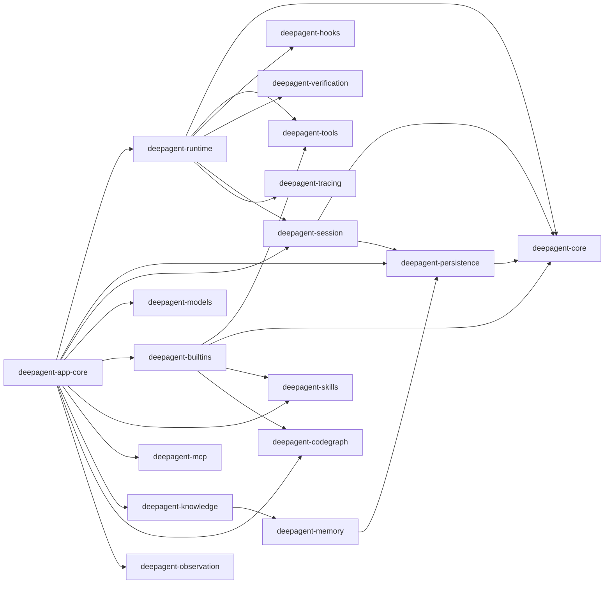

# Rust Crates 全览

## 5. Rust workspace crate 全览

根 `Cargo.toml` 当前 members：

| Crate | 职责 | 关键模块/能力 |
| --- | --- | --- |
| `deepagent-core` | 领域原语 | id、event、message、task、clock、error、session_mode |
| `deepagent-tracing` | 可观测基础 | tracing 初始化、进程内 metrics |
| `deepagent-persistence` | 持久化 | SQLite、迁移、事件存储、文档存储、成本存储 |
| `deepagent-session` | 会话聚合 | replay、recover、fork、rewind、事件追加 |
| `deepagent-context` | 上下文工程 | prompt AST、tokenizer、budget、pipeline、compaction |
| `deepagent-memory` | 记忆检索 | BM25、语义检索、混合检索、排序、embedding、contextual retrieval |
| `deepagent-knowledge` | 知识库 | vault、entry、capture、base，支持主动知识和草稿 |
| `deepagent-tools` | 工具抽象 | Tool trait、registry、permission、sandbox、WASM |
| `deepagent-builtins` | 内置工具 | 文件、bash、todo、task、web、knowledge、office、codegraph、project_map、git、ask_user |
| `deepagent-intent` | 输入意图 | slash 命令、附件、命令注册、路由 |
| `deepagent-skills` | 技能系统 | `SKILL.md` 解析、扫描、安装、市场、frontmatter、registry |
| `deepagent-prompts` | 提示词资源 | frontmatter、agent def、command loader、system prompt builder |
| `deepagent-runtime` | Agent 运行循环 | loop_engine、model_agent、events、approval、tool budget、decorator |
| `deepagent-models` | 模型层 | DeepSeek transport、SSE、stream、chat request、model discovery、balance |
| `deepagent-hooks` | Hook 与权限 | hook registry、lifecycle、permission rules、external hooks |
| `deepagent-workspace` | 工作区扫描 | scanner、snapshot、git 信息 |
| `deepagent-verification` | 自愈验证 | verifier、runner、reflection、healing |
| `deepagent-planner` | 规划 | DAG、planner |
| `deepagent-subagents` | 子代理 | scheduler、subagent、git worktree |
| `deepagent-observation` | 观察与导出 | timeline、stats、transcript |
| `deepagent-security` | 安全门禁 | secret scanning、CI gate |
| `deepagent-app-core` | UI 服务门面 | DTO + 所有桌面服务，Tauri/web 均应只依赖它 |
| `deepagent-mcp` | MCP 客户端 | config、transport、stdio/http、client、registry、adapter |
| `deepagent-codegraph` | 原生代码图谱 | scanner、tree-sitter extraction、store、resolution、query、projection |
| `apps/cli` | 无头演示 | 打开 DB、跑一次脚本化 Agent、从事件恢复 |

### 5.1 crate 依赖结构图

