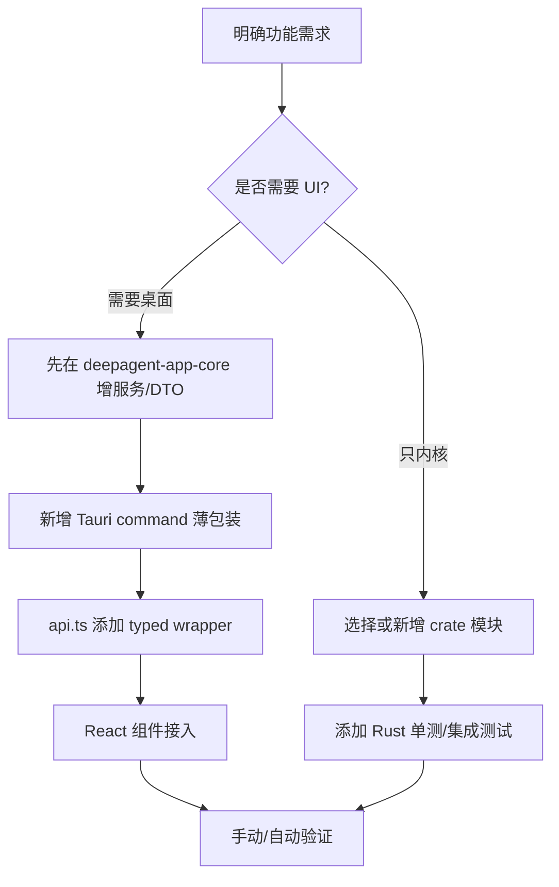
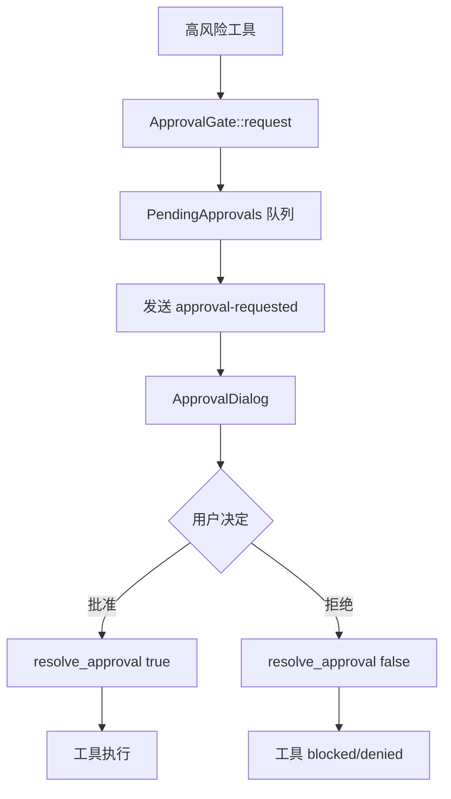

# 开发工作流与 CI

## 31. 安全扫描与 CI

`deepagent-security` 提供密钥扫描和门禁逻辑。`.github/workflows` 包含：

- `ci.yml`：核心 CI。
- `release-desktop.yml`：桌面打包发布。

推荐本地检查：

```bash
cargo test --workspace --offline
cargo clippy --workspace --all-targets --offline -- -D warnings
cd apps/desktop && pnpm build
```

针对 codegraph：

```bash
cargo test -p deepagent-codegraph --offline
cargo clippy -p deepagent-codegraph --all-targets --offline -- -D warnings
```

## 35. 开发新功能的推荐路径



原则：

- UI 不直接依赖内核内部类型，统一通过 app-core DTO。
- 新的持久状态优先放 DocumentStore；会话事实必须放事件流。
- 新工具统一实现 `Tool`，注册到 `ToolRegistry`，并明确 permission/risk。
- 涉及文件系统、命令、网络的功能必须考虑审批、沙箱、Hook、敏感路径。
- 新 Tauri 命令应保持薄层，只做参数转发、错误字符串化和事件转发。
- 前端 API wrapper 应提供浏览器模式 fallback 或明确抛错。
- 对 replay 相关功能，必须考虑历史会话重建，而不仅是 live event。

## 36. 常见流程索引

### 36.1 新建聊天

```mermaid
flowchart TD
    StartView[StartView 提交 prompt] --> AppSubmit[App.tsx onSubmit]
    AppSubmit --> Messages[插入本地 user message]
    Messages --> Run[api.runChat(prompt, null, runId)]
    Run --> Backend[run_chat 后台任务]
    Backend --> SessionRegistered[收到 session_registered]
    SessionRegistered --> Sidebar[刷新 sessions]
    SessionRegistered --> Navigate[切到 chat view]
    Backend --> Stream[持续追加 token/reasoning/tool]
    Stream --> Complete[session-completed]
    Complete --> Detail[刷新 detail/conversation/cost]
```

### 36.2 继续会话

```mermaid
flowchart TD
    Select[选择已有 session] --> Load[getSessionConversation]
    Load --> Render[渲染历史 text/reasoning/tool/usage]
    User[发送新 prompt] --> Run[runChat(prompt, sessionId)]
    Run --> Recover[Session::recover]
    Recover --> Append[追加新 task/user message]
    Append --> Runtime[RuntimeEngine 继续运行]
```

### 36.3 停止运行

```mermaid
flowchart TD
    Click[用户点击停止] --> API[stopChat(sessionId)]
    API --> Tauri[stop_chat]
    Tauri --> CS[ChatService::cancel_session]
    CS --> Flag[设置 AtomicBool cancel=true]
    Flag --> Boundary[Runtime step boundary]
    Boundary --> Cancel[RunCancelled event]
    Cancel --> UI[移除 runningSessionIds，保留部分 transcript]
```

### 36.4 审批工具



### 36.5 项目地图搜索

```mermaid
flowchart TD
    Panel[ProjectMapPanel 输入 query] --> API[projectMapSearch]
    API --> PMS[ProjectMapService::search]
    PMS --> Load[load knowledge-graph.json]
    Load --> Score[名称/路径/summary/tag/type 匹配打分]
    Score --> Hits[ProjectMapHitDto[]]
    Hits --> Panel
```

### 36.6 Git diff

```mermaid
flowchart TD
    Changes[GitChangesPanel 选择文件] --> API[gitDiff(path,file,staged)]
    API --> GS[GitService::diff]
    GS --> Root{repo_root?}
    Root -->|否| Empty[返回 is_repo=false]
    Root -->|是| Cmd[git diff --no-ext-diff -- file]
    Cmd --> Truncate[truncate 96KB]
    Truncate --> UI[GitDiffViewer]
```

### 36.7 Office 会议纪要

```mermaid
flowchart TD
    Rec[RecordingPlugin 录音] --> Stop[audio_stop_recording]
    Stop --> Wav[生成 wav]
    Wav --> Transcribe[speech_transcribe_file]
    Transcribe --> Transcript[TranscriptSegment[]]
    Transcript --> Minutes[speech_generate_meeting_minutes]
    Minutes --> Docx[office_export_minutes_docx]
    Docx --> Preview[FilePreviewPlugin / 打开文件]
```

