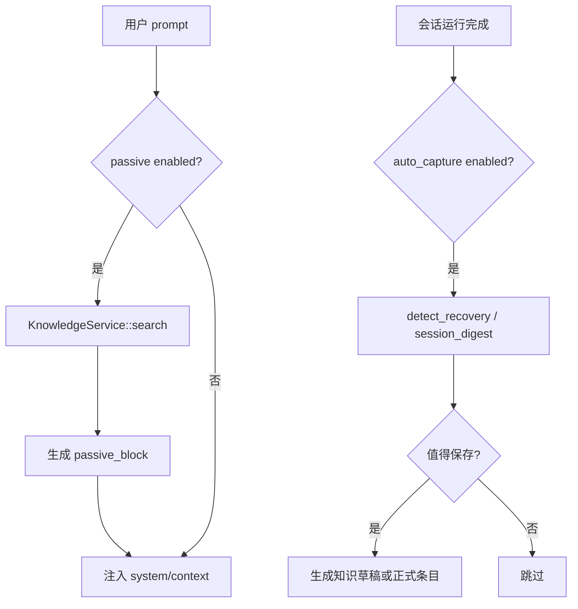

# 知识库与记忆

## 17. 知识库与记忆

知识库由 `deepagent-knowledge` 和 `KnowledgeService` 承载。它和低层 `deepagent-memory` 的检索能力配合使用。

功能：

- `kb_list`：列出知识条目。
- `kb_search`：按 query、kind、limit 检索。
- `kb_get`：获取单条。
- `kb_save`：保存主动知识。
- `kb_delete`：删除。
- `kb_reload`：重扫 vault。
- `kb_set_passive` / `kb_passive_enabled`：控制被动注入。
- `kb_set_auto_capture` / `kb_auto_capture_enabled`：控制自动捕获。
- `kb_list_drafts` / `kb_accept_draft` / `kb_discard_draft`：管理草稿。

知识条目种类包括 pitfall、solution、command、config、note 等。条目可作用于 project 或 global scope。

