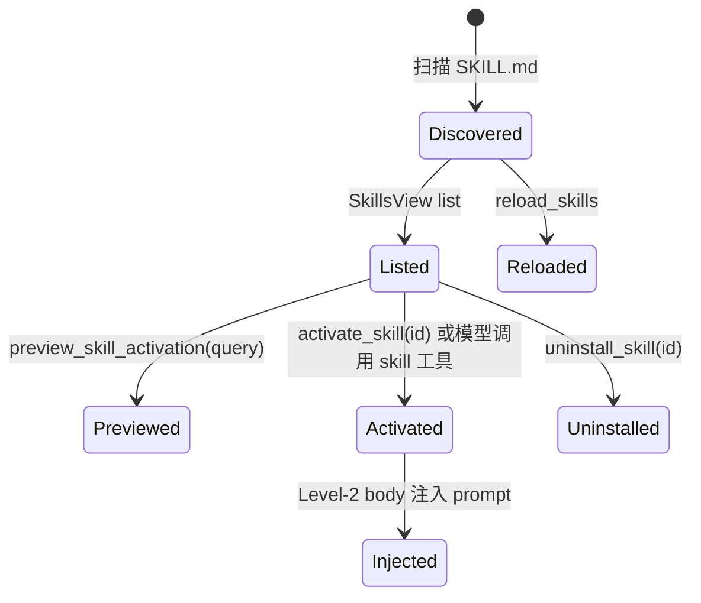
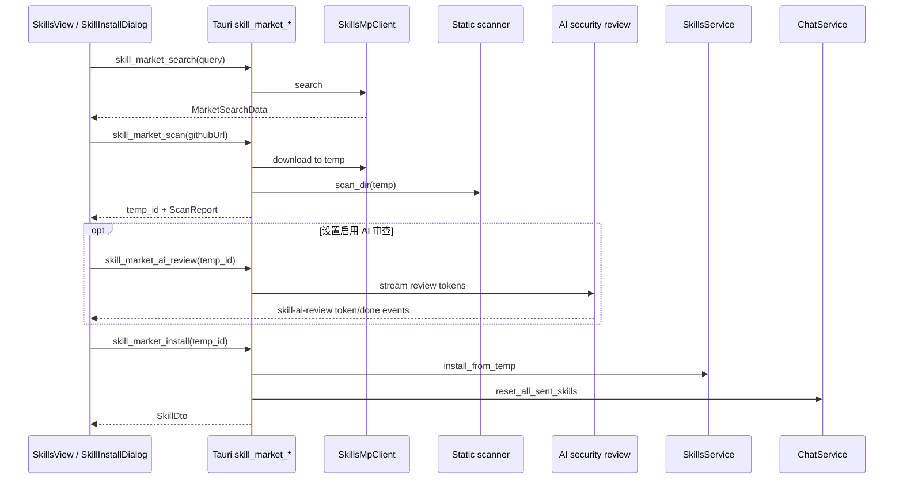

# 技能系统

## 16. 技能系统

技能由 `SKILL.md` 描述，可来自四层 roots：

1. BuiltIn：打包随应用发布的内置技能。
2. Installed/Marketplace：用户从市场安装的技能。
3. User：用户个人技能目录。
4. Workspace：项目内 `.deepagent/skills`。

优先级从低到高加载，后加载的同 id 技能覆盖前者：BuiltIn -> Installed -> User -> Workspace。

### 16.1 技能生命周期

### 16.2 技能市场安装流程

安全细节：

- `PendingScan` 持有临时目录句柄，安装或取消前不会被提前删除。
- 临时扫描 TTL 为 30 分钟，相关命令会懒清理过期项。
- 安装前静态扫描风险，如 shell、网络、凭证、越界写、混淆等。
- 可选 AI 审查使用固定中文 system prompt，要求输出 `=== ANALYSIS ===` 和 `=== VERDICT ===`。
- 内置技能禁止卸载。
- 技能集发生变化后会重置 `ChatService` 的技能目录发送状态，下一轮重新提示模型。

