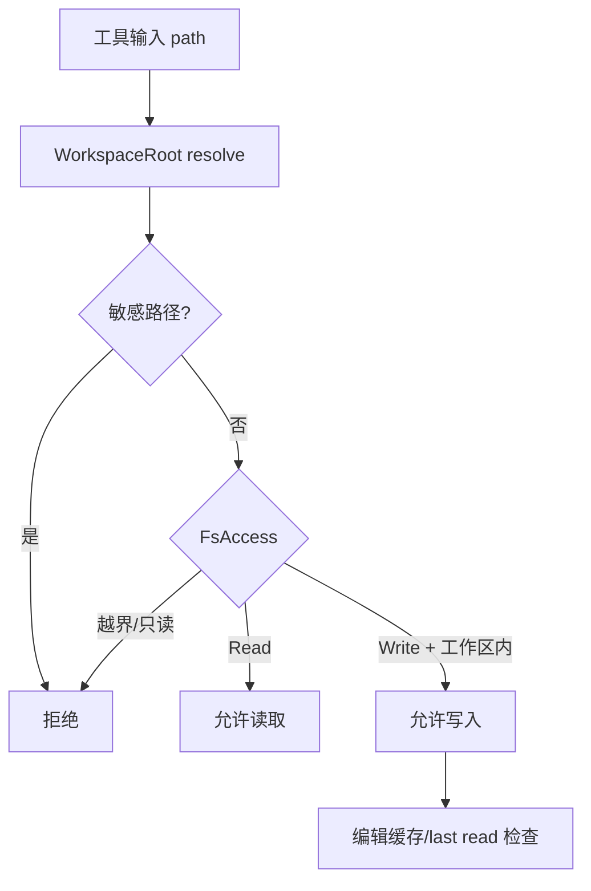

# 内置工具

## 12. 工具系统

### 12.1 工具抽象

`deepagent-tools` 提供：

- `Tool` trait：工具的名字、描述、JSON schema、权限、执行逻辑。
- `ToolRegistry`：注册和按名称查找工具。
- `PermissionSet` / `RiskLevel`：权限和风险模型。
- `SandboxedTool` / WASM：为未来的 WASM 工具提供隔离执行。

### 12.2 内置工具分类

| 分类 | 工具/模块 | 说明 |
| --- | --- | --- |
| 文件 | `ReadFileTool`, `WriteFileTool`, `EditFileTool`, `MultiEditTool`, `ListDirTool`, `GlobTool`, `GrepTool` | 工作区路径解析、敏感路径防护、读取缓存、编辑前读检查 |
| Shell | `BashTool` | 执行命令，受 allowlist、危险命令拦截、审批约束 |
| Todo | `TodoWriteTool`, `TaskListTool`, `TodoStore` | 计划/任务快照，运行中可提醒模型 |
| Plan mode | `EnterPlanModeTool`, `ExitPlanModeTool`, `PlanModeHook` | 只读规划模式与允许工具白名单 |
| 子代理 | `TaskTool` | 通过 `SubagentRunner` 派发子任务 |
| Web | `WebFetchTool`, `WebSearchTool`, `ReqwestWebClient` | fetch/search，DeepSeek search provider 可选 |
| 知识库 | `KnowledgeSearchTool`, `KnowledgeWriteTool` | 搜索和写入知识条目 |
| 技能 | `SkillTool` | 主动激活技能，披露 Level-2 内容 |
| Office | `OfficeReadTool`, `OfficeDocxCreateTool`, `OfficeXlsxCreateTool` | 读取/生成 Office 文档 |
| 代码图谱 | `CodeGraphSearchTool`, `CodeGraphExploreTool`, `CodeGraphCallersTool`, `CodeGraphCalleesTool`, `CodeGraphImpactTool`, `CodeGraphNodeTool`, `CodeGraphLocateTool` | AI 可查询精确代码图谱 |
| 项目地图 | `project_map_tools` | UI/Agent 访问 `.understand-anything` 投影图 |
| Git | `GitStatusTool`, `GitDiffTool`, `GitLogTool`, `GitCommitTool` | Agent Git 辅助能力 |
| Ask user | `AskUserTool` | 请求用户输入/确认 |
| Tool search | `ToolSearchTool` | 延迟暴露工具，按 query 检索 deferred tool |

### 12.3 文件工具防护

