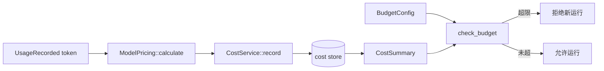

# 成本与预算

## 24. 成本与预算

`CostService` 根据 `ModelPricing` 计算成本并记录 `CostRecord`。当前支持：

- 模型定价表：输入、输出、cache hit token 等维度。
- `record`：写入一次运行的 token 和成本。
- `summary(session_id?)`：按会话或全局汇总。
- `set_budget`：配置日/月预算。
- `check_budget`：运行前拒绝超预算任务。

