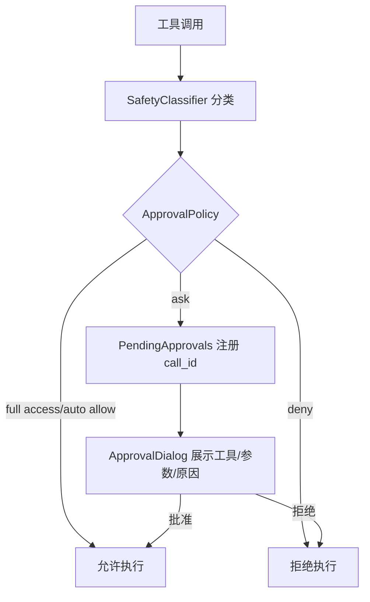
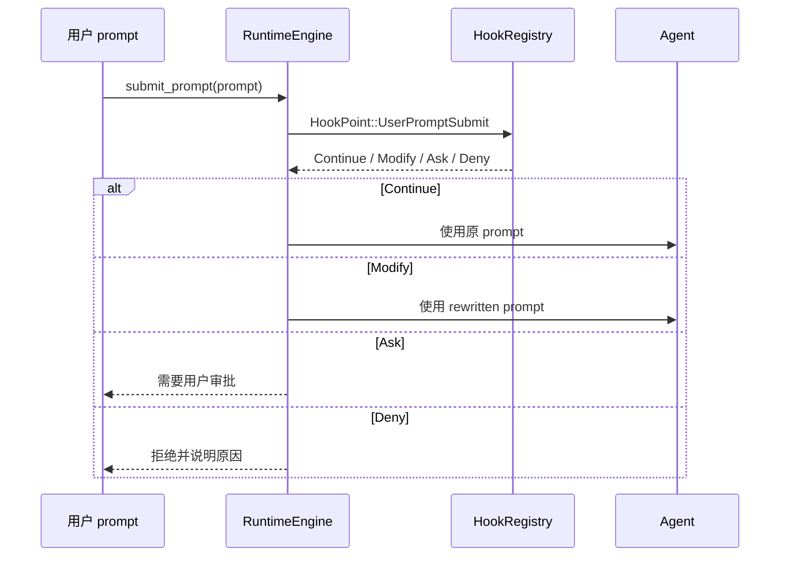

# 沙箱、权限与 Hook

## 11. 审批、权限、沙箱与 Hook

### 11.1 审批策略

`SettingsService` 暴露 `ApprovalPolicy`，`PolicyGate` 根据策略和安全分类器决定是否直接允许、拒绝或交给 UI。

典型路径：

### 11.2 沙箱模式

`SandboxMode` 影响文件和命令工具的边界：

- `read_only`：允许读，阻止写入类操作。
- `workspace_write`：允许工作区内写入，阻止越界和敏感路径。
- `full_access`：更开放，但仍可叠加 Hook/权限规则。

### 11.3 Hook 生命周期

`deepagent-hooks` 支持生命周期点，`RuntimeEngine` 当前会触发：

- `SessionStart`
- `UserPromptSubmit`
- `SessionEnd`

工具执行前后、权限规则、外部 hooks 由 `deepagent-hooks` 和 `deepagent-builtins::guard_hooks` 配合承载。`hooks.json` 可在设置页编辑，`SettingsService::set_hooks_json` 会验证并保存。

