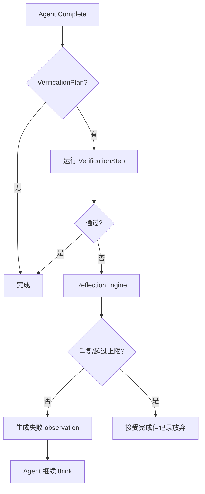

# 自愈验证

## 29. 自愈验证

`deepagent-verification` 与 `RuntimeEngine` 配合：

- Agent 宣布完成后，如果附加了 `VerificationPlan`，运行 build/test/lint 等步骤。
- 验证失败时通过 `ReflectionEngine` 判断是否重复失败、是否继续。
- 可重试时把反思作为 observation 喂回 Agent，让它继续修复。
- 超过重复或尝试上限后 `GaveUp`，运行接受最终结果但可记录失败信息。

