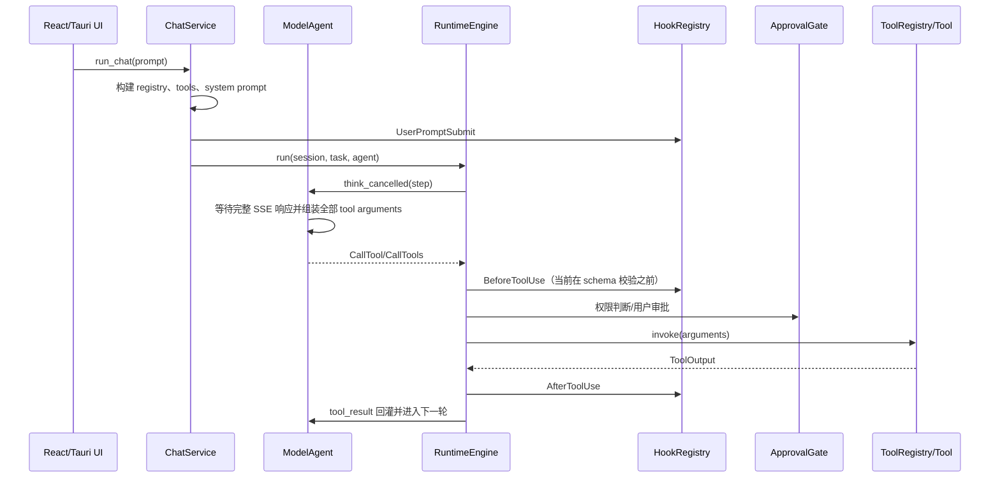
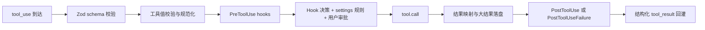

# DeepAgent 任务执行链路调研与重构方案

日期：2026-07-27

范围：

- DeepAgent 当前任务执行、工具、Hook、权限、取消、日志和终态链路
- `runtime-logs.db` 中 2026-07-27 的 9 次真实运行
- `借鉴/claudecode/restored-src` 中 Claude Code 的对应实现
- 本报告只做调研和方案设计，不修改业务代码

## 1. 结论

本次“生成大学生就业调研报告”耗时 105.77 秒且没有完成，主要问题不是工具执行慢，而是执行链路在模型输出约束、命令承载、Hook 配置、异常终态四个层面同时失效。

最直接的证据如下：

1. 模型在第 2 轮生成了 7,790 个 completion tokens，把 23,003 字符的 JavaScript 全部塞进一条 `node -e` 命令，单轮模型耗时 57.428 秒。
2. 这条命令经 PowerShell UTF-16LE Base64 编码后达到 61,624 字符，超过 Windows `CreateProcess` 的 32,767 字符上限 28,857 字符，必然无法启动。
3. 3 个 Hook 全部报错。配置同时指定 `shell: powershell`，但 `command` 又包含完整的 `powershell ... -Command "..."` 启动器，导致外层 PowerShell 提前展开内层 `$j`、`$p` 等变量，实际执行文本变成 `=[Console]::In.ReadToEnd()`。
4. 第 3 轮模型已经输出“命令太长。更好的方式是将脚本写入一个 `.js` 文件再执行。”，但 SSE 随后约 42 秒没有正常完成。运行时直接返回错误，没有发出 `ModelRequestFailed` / `RunFailed`，也没有把 task 从 `running` 改为 `failed`。
5. 会话事件库最终只有 `tool_call_completed(ok=false)`，没有 assistant 最终消息、`usage_recorded` 和任务终态。也就是说，UI 看到了流式错误文本，但持久化状态已经损坏。

按 105.77 秒总时长估算：模型等待约 103.2 秒，占 97% 以上；Hook 2.055 秒；工具进程 0.470 秒。当前首先要修的是模型到工具之间的执行协议和失败终态，不是优化 Rust 工具函数的毫秒级耗时。

## 2. 本次真实运行还原

数据来源：

- 诊断日志：`apps/desktop/src-tauri/target/debug/runtime-logs.db`
- 会话事件：`C:/Users/32734/AppData/Roaming/com.deepagent.studio/deepagent.db`
- run id：`b8ef571e-659c-434a-9c0b-8687501363b1`
- session id：`ses_019fa40c99ef72b38afb45d583cfaa5b`

| 相对阶段 | 事件 | 耗时/结果 |
|---|---|---|
| 0 ms | `run_requested` | 继续已有会话，工作区 `G:\Code\Kotlin_code` |
| 2 ms | 权限解析 | `always_ask + workspace_write + SandboxiePreferred` |
| 143 ms | UserPromptSubmit hook 1 | 618 ms，PowerShell 语法错误 |
| 760 ms | UserPromptSubmit hook 2 | 595 ms，PowerShell 语法错误 |
| 1.264 s | runtime 开始 | 38 个可见工具，工具 schema 约 7,362 tokens |
| step 0 | 模型请求 | 1.847 s，调用 `list_dir` |
| step 0 tool | `list_dir` | 0 ms，目录为空 |
| step 1 | 模型请求 | 1.562 s，调用 `skill(id=docx)` |
| step 1 tool | `skill` | 0 ms，返回完整 DOCX skill 内容 |
| step 2 | 模型请求 | 57.428 s，18,795 prompt + 7,790 completion tokens |
| step 2 output | `bash` 参数 | 23,003 字符，29,447 UTF-8 bytes |
| PreToolUse | hook 3 | 842 ms，PowerShell 变量被提前展开，Hook 失效 |
| tool | `bash` | 470 ms，`os error 206`，进程未启动 |
| step 3 | 模型请求 | 1.385 s 出现首 token，输出正确恢复建议 |
| step 3 终态 | SSE/模型调用 | 约 42 秒后错误退出，没有 completed/failed 事件 |

### 2.1 Token 与失败放大

本轮 UI 展示约 49k tokens，来自前三次完整模型请求累计：

- step 0：11,141
- step 1：11,237
- step 2：26,585
- 合计：48,963

step 3 没有拿到 provider usage，因此没有计入真实 token 总量和费用。当前成本记录低估了失败运行。

### 2.2 最近 9 次运行暴露出的模式

| 任务 | 总时长 | 模型轮次 | 工具调用 | 工具失败 | Prompt tokens | 是否有终态 |
|---|---:|---:|---:|---:|---:|---|
| 当前目录下有哪些文件 | 3.63 s | 2 | 1 | 0 | 21,426 | 是 |
| 删除 `check_dir.py` | 27.68 s | 9 | 8 | 5 | 105,552 | 是 |
| 删除 `.ruff_cache` | 13.58 s | 3 | 2 | 1 | 33,144 | 是 |
| 生成就业调研报告 | 105.77 s | 4 | 3 | 1 | 41,041（不含失败 step 3） | 否 |

简单读取链路可以在 2 个模型轮次内完成。低效率集中在“需要写入或执行”的任务：模型先试错，再把错误回灌，再调用模型恢复，导致每次失败都新增一次完整 prompt 和一次网络往返。

## 3. DeepAgent 当前执行链

相关实现：

- Tauri 异步入口：`apps/desktop/src-tauri/src/lib.rs:1785`
- Chat 组装 registry/hooks/runtime：`crates/deepagent-app-core/src/chat_service.rs:3230`
- 主循环：`crates/deepagent-runtime/src/loop_engine.rs:275`
- 模型完整响应组装：`crates/deepagent-runtime/src/model_agent.rs:218`
- 单工具执行：`crates/deepagent-runtime/src/loop_engine.rs:775`
- 工具 registry：`crates/deepagent-tools/src/registry.rs:138`

### 3.1 当前链路的结构性问题

1. `ToolRegistry` 只检查工具存在、PermissionSet 和高风险审批，不执行 JSON Schema 校验。Hook 和权限系统先接收到未经验证的参数。
2. `ModelAgent` 只有完整响应完成后才返回 tool call。它知道 tool name 已经开始流式出现，但没有流式工具执行器。
3. `bash` 同时暴露 7 种 shell 选择。模型需要自己判断 OS、方言和转义，错误空间过大。
4. Windows PowerShell 一律使用 `-EncodedCommand`，没有 argv 长度预算和 `-File` 回退。
5. `ThinkingDepth::Simple` 没有设置 `max_tokens`；模型能力快照声称最高 384k output，ContextPolicy 还为 simple 预留 64k，但这些预算没有转化为请求级输出上限。
6. Agent/model 错误在 `RuntimeEngine::run` 中直接 `return Err(e)`，跳过 task failed、RunFailed、UsageRecorded、SessionEnd 和清理。
7. 日志有两条写入路径：ChatService 直接写库，以及 RuntimeEvent pump 异步写库。因而 `user_prompt_submit_accepted` 可以排在 `hook_completed` 之前，数据库 id 不能代表真实因果顺序。
8. 每个 1 到 3 字符的 content delta 都单独写 SQLite；详细但不高效，也不利于按 span 分析。

## 4. Claude Code 对应链路

Claude Code 的主链不是“模型输出后直接调用 shell”，而是一个分阶段 ToolExecutionPipeline：

关键实现：

- Query 状态机和恢复：`借鉴/claudecode/restored-src/src/query.ts:540`
- 工具串并行编排：`借鉴/claudecode/restored-src/src/services/tools/toolOrchestration.ts:19`
- 流式工具执行和 sibling cancellation：`借鉴/claudecode/restored-src/src/services/tools/StreamingToolExecutor.ts:40`
- 完整工具 pipeline：`借鉴/claudecode/restored-src/src/services/tools/toolExecution.ts:599`
- Hook 与权限合并：`借鉴/claudecode/restored-src/src/services/tools/toolHooks.ts:390`
- PowerShell Hook 独立 spawn：`借鉴/claudecode/restored-src/src/utils/hooks.ts:742`
- Windows PowerShell argv 预算：`借鉴/claudecode/restored-src/src/utils/powershell/parser.ts:627`
- Windows 专用 PowerShell tool：`借鉴/claudecode/restored-src/src/tools/PowerShellTool/PowerShellTool.tsx:272`
- 原子文件写入和 read-before-write：`借鉴/claudecode/restored-src/src/tools/FileWriteTool/FileWriteTool.ts:94`

### 4.1 值得直接借鉴的机制

1. schema 校验在 Hook 和权限之前。无效调用不会触发安全 Hook，更不会进入执行器。
2. Hook 配置里的 `command` 是当前 shell 的命令体。`shell: powershell` 时直接 spawn `pwsh -NoProfile -NonInteractive -Command <body>`，不会再把完整 `powershell -Command` 套一层。
3. Windows PowerShell 有独立工具、版本探测、AST 解析、命令长度上限、非交互约束和专属安全规则。
4. 文件内容必须走 Write/Edit；Shell 用于运行脚本。这样大段源码不会成为 shell argv。
5. 可并发读工具并发执行，写入和命令工具串行；Bash 失败会取消无意义的 sibling subprocess。
6. 工具大输出落到 tool-results 文件，只把预览和路径回灌模型。
7. API 错误、max output、context overflow、abort 和 stop hook 都是明确状态转移，不依赖 UI 猜测。
8. Stop hook 只在模型产生有效完成结果后执行；API 错误会跳过 Stop hook，避免错误重试死循环。

## 5. 差距判断

“底层参考 Claude Code”只复用了部分事件名、Hook 协议和 agent loop 外形，还没有复用 Claude Code 最关键的执行边界。当前主要差距如下：

| 能力 | Claude Code | DeepAgent 当前 | 影响 |
|---|---|---|---|
| 工具参数校验 | schema + tool validate，先于 Hook | 工具内部零散校验，晚于 Hook | Hook 看到无效/危险形态输入 |
| Windows shell | 独立 PowerShell tool | 一个 bash tool + 7 种 shell enum | 模型方言试错 |
| 长命令 | 有 argv 预算，设计中明确 `-File` 回退 | 总是 EncodedCommand | 必现 error 206 |
| 大段代码 | Write 文件后运行 | 仅靠提示词要求 | 弱模型仍会 `node -e` |
| Hook shell | command body + shell runner | 允许重复写 launcher | `$变量` 被二次展开 |
| 流式工具 | 支持 StreamingToolExecutor | 等完整模型响应 | 多工具不能与模型输出重叠 |
| 模型失败终态 | 明确 error/recovery/terminal | Err 直接冒泡 | task 永久 running |
| 日志顺序 | 统一事件与 span | 直接写 + 异步 pump | 因果顺序不可信 |
| 输出预算 | turn/task budget + recovery | 请求 max_tokens 未设置 | 单轮可生成超大无效参数 |

模型本身也必须单独看待。`deepseek-v4-flash` 不是 Claude，不能假设 Claude Code 的提示词在该模型上会得到同等工具选择质量。执行层必须把“正确行为”做成约束和类型，而不是寄希望于模型从失败中学习。

## 6. 修复与重构方案

### P0：先恢复正确性和可诊断性

#### P0.1 统一工具调用前置校验

在 `deepagent-tools` 增加 `InvocationValidator`：

1. 校验工具是否存在。
2. 使用 descriptor JSON Schema 校验参数类型、required、enum 和 additionalProperties。
3. 调用工具级 `validate_input/normalize_input`。
4. 只有校验通过后才执行 BeforeToolUse Hook 和权限判断。

日志状态统一为：`received -> schema_validated -> normalized -> hook_checked -> permission_resolved -> started -> completed/failed`。

#### P0.2 修复 PowerShell 命令承载

短命令继续使用 `-EncodedCommand`。编码后的 argv 接近 Windows 上限时：

1. 将命令体写入 run-scoped 临时 `.ps1`。
2. 使用 `powershell/pwsh -NoProfile -NonInteractive -File <path>`。
3. 传递 cwd、env、stdin、timeout、cancel。
4. 进程结束后清理临时文件。
5. 日志记录 `transport=encoded|temp_file`、原始 bytes、encoded chars 和临时路径。

本次 23,003 字符命令用 `-File` 可以避免外层 Base64 膨胀。对于 `node -e`、`python -c` 等大段 inline code，还应在模型协议中要求使用 `write_file + node/python script`，后续增加一等 `run_script` 工具。

#### P0.3 修复 Hook 配置契约

1. `shell=powershell` 时 command 只保存 PowerShell body。
2. 保存时检测 `powershell ... -Command` / `pwsh ... -Command` 重复 launcher，给出错误并提供自动规范化。
3. 保存前必须执行真实 stdin Unicode 测试，确认 `$变量` 未丢失。
4. Hook 测试与真实运行共用同一 runner、cwd、env 和 shell 解析。
5. 无效 Hook 不进入 enabled 状态；安全 Hook 失败必须在设置页和运行诊断中持续告警。
6. 同一事件下互不修改输入的 command hooks 可并行，保留决策聚合顺序。

#### P0.4 保证任何退出都有终态

重写 `RuntimeEngine::run` 的退出结构，核心 loop 不得通过 `?`/`return Err` 绕过 finalizer：

- cancel：task failed/cancelled + `RunCancelled`
- model/API error：task failed + `ModelRequestFailed` + `RunFailed`
- tool fatal error：task failed + `RunFailed`
- success：task completed + `RunCompleted`
- 所有分支：UsageRecorded（允许 partial）、SessionEnd best-effort、临时文件清理、cancel map 清理

Tauri `session://completed` 只负责传输最终结果，不再承担修正数据库状态的职责。

#### P0.5 增加模型流 watchdog 和请求上限

1. 增加 connect timeout、首 token timeout、SSE idle timeout 和整轮 deadline，分别记录。
2. 收到部分内容后流异常时，发出 `ModelRequestFailed { phase, elapsed, bytes, had_partial }`。
3. 工具尚未执行时允许一次安全重试；重试前丢弃 partial assistant message。
4. 为 agent turn 显式设置 `max_tokens`，不要沿用 capability 的 384k 理论上限。
5. 普通轮次、artifact 轮次、reasoning 轮次使用不同预算；命中 length 时进入明确 recovery，而不是交给 provider 自由输出。

#### P0.6 修正 DOCX skill 的可执行工作流

在 skill 最前面增加不可歧义的步骤：

1. `write_file(<workspace>/.deepagent-tmp/create-report.js, content)`
2. `bash(node <script-path>)`
3. 运行 DOCX validator
4. 验证目标文件存在且可打开
5. 删除临时脚本或将其作为交付物保留

明确禁止把文档生成源码放进 `node -e`。

### P1：重构成可维护的 ToolExecutionPipeline

#### P1.1 平台原生 shell 工具

启动时只向模型暴露当前平台真正可用的 shell：

- Windows：`powershell`，可选 `cmd` / `wsl`
- Linux：`bash` / `sh`
- macOS：`zsh` / `bash`

不要让每个调用都携带 7 选 1 的 shell enum。平台 executor 统一实现 stdin、cwd、env、timeout、cancel、output limit、temp script 和进程树终止。

#### P1.2 流式和并发工具编排

参考 `StreamingToolExecutor`：

- tool block 完整后尽早排队，不等待同一 assistant message 的所有后续 blocks。
- 连续只读工具并发，写工具和 shell 工具独占。
- 每个工具使用 child cancellation token。
- 命令失败时取消同批依赖命令，但不取消无关读取。
- 结果按模型 tool call 顺序回灌，UI 进度按真实完成顺序更新。

#### P1.3 Skill 结果按需加载

当前 DOCX skill 一次返回完整长文，step 2 prompt cache miss 增加 7,659 tokens。改为：

- `skill(id)` 返回 300 到 800 tokens 的 quick workflow 和 section index。
- `skill_read(id, section)` 按需读取 Tables、Images、Editing 等章节。
- 用户在 Composer 已显式选择 skill 时，首轮直接注入 quick workflow，省掉一次模型 round trip。

#### P1.4 统一日志流水线

所有诊断事件进入单一 append-only writer：

- 全局 `log_id`
- run 内 `sequence`
- `span_id` / `parent_span_id`
- `phase`
- `started_at` / `duration_ms`
- `status` / `error_code`
- payload preview、payload size、payload hash

content/reasoning delta 以 50 到 100 ms 或 1 KB 聚合后写入，保留完整性但避免每 1 到 3 个字符一次 SQLite transaction。

#### P1.5 冷启动拆分

本次会话首轮从 `session_bound` 到 `registry_ready` 约 9 秒，下一轮只有约 3 ms。应给 registry build 增加子 span，并把 MCP/skill/plugin 初始化移到应用启动或后台 lazy init；聊天首轮只读取已缓存 descriptor。

### P2：面向模型质量的执行规划

1. 增加本地 `TaskIntent` 路由：read、mutation、artifact、research、destructive。
2. artifact 任务自动注入“源码落盘 -> 运行 -> 验证”的 execution contract。
3. 对 shell 命令做本地语义分类；已存在 dedicated tool 的文件操作直接拒绝并给出目标工具，不消耗真实进程调用。
4. 对连续失败做 bounded recovery：同类错误最多一次纠正，禁止随机切换 `rm/del/python/Remove-Item` 方言。
5. 使用真实 E2E 轨迹评估不同模型，而不是只验证模型能否返回合法 tool_calls。

## 7. 测试与验收

### 7.1 必须新增的 E2E

1. Windows 中文+空格路径，23k 字符 PowerShell 命令自动转 `-File` 并成功执行。
2. `shell=powershell` Hook body 使用 `$j=[Console]::In.ReadToEnd()`，能够读取 Unicode JSON；exit 2 能阻断工具。
3. 重复 launcher 配置在保存时被拒绝或规范化。
4. 模型返回部分 token 后断流，1 秒内出现 `ModelRequestFailed` 和 `RunFailed`，task 不得残留 running。
5. 模型、Hook、审批、shell 任一阶段点击停止，500 ms 内进入 cancelled，子进程树被终止。
6. DOCX 任务必须走 `write_file -> node script -> validate`，不得出现 `node -e` 超长参数。
7. 所有运行在 IPC promise settle 后都恰好有一个 terminal event。
8. runtime log 的 run sequence 单调递增，不能出现 accepted 排在对应 hook completed 之前。

### 7.2 目标指标

| 指标 | 目标 |
|---|---:|
| 温启动简单读取 p95 | <= 6 s |
| 简单本地写入 p95 | <= 10 s |
| 工具首次执行成功率 | >= 95% |
| 运行终态完整率 | 100% |
| 无效 Hook 启用率 | 0% |
| 停止到终态 p95 | <= 500 ms |
| 同一任务 shell 方言试错次数 | 0 |
| 失败运行可归因率 | 100% |

## 8. 建议实施顺序

1. 先做 P0.4 和 P0.5：任何失败都能正确结束并留下可用日志。
2. 再做 P0.2 和 P0.3：修复当前 PowerShell 和 Hook 的确定性错误。
3. 接着做 P0.1 和 P0.6：把正确工具选择变成前置约束和明确工作流。
4. 用本报告 7.1 的 E2E 全部跑通后，再进入 P1 pipeline 重构。
5. 最后做 P2 的模型路由和质量优化，避免在状态机仍不可靠时用提示词掩盖底层缺陷。

## 9. 最终判断

DeepAgent 已经具备 ToolRegistry、HookRegistry、ApprovalGate、RuntimeEngine、取消 token 和 SQLite 日志等必要组件，问题不是必须推倒重写。需要重构的是这些组件之间的协议和顺序。

最关键的架构边界应固定为：

`模型候选动作 -> schema/平台规范化 -> Hook -> 权限 -> 执行 -> 验证 -> 结构化结果 -> 下一轮模型`

只要 P0 做完整，本次任务即使模型仍生成 23k 的 inline command，也应该被确定性承载或在执行前给出可恢复的类型化结果；运行不能卡住，更不能留下永久 running 的 task。P1 完成后，系统才算真正接近 Claude Code 的任务执行链，而不只是拥有相似的 Hook 名称和 agent loop 外形。
