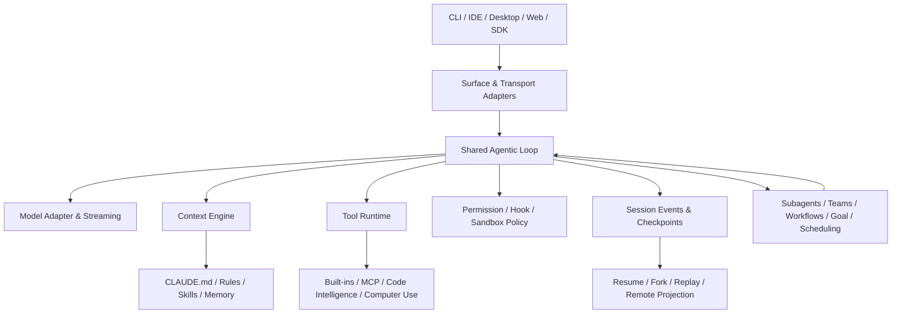
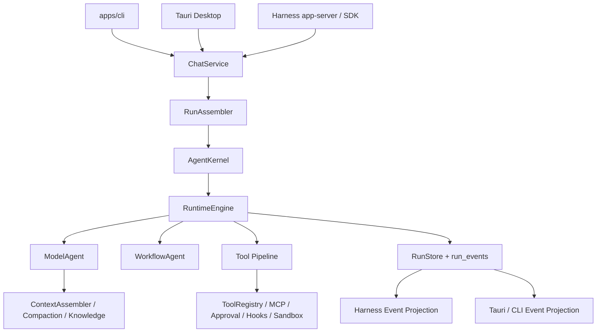

# Claude Code Harness 全景架构与 DeepAgent Studio 差距研究报告

> 研究日期：2026-09-30
> DeepAgent 基线：`main@d7b4e5a81099`
> Claude Code 源码样本：`借鉴/claudecode` v2.1.88，`restored-src/src` 共 1,902 个文件、约 477,439 行
> 当前产品基线：Claude Code 官方文档（抓取于 2026-09-30，包含晚于 v2.1.88 的公开能力）
> 文档性质：架构研究与差距评估，不是逐项照搬 Claude Code 的实施承诺

---

## 1. 执行摘要

### 1.1 最重要的判断

DeepAgent Studio **不是在系统架构上“达不到 Claude Code”**。当前仓库已经具备一套相当完整的 Agent runtime 骨架：统一运行内核、事件持久化、上下文装配与压缩、DeepSeek 原生模型适配、工具与 MCP、权限与审批、Hooks、子代理、Worktree、Harness 协议、Rust/TypeScript SDK、Windows Sandbox、插件系统和桌面工作流。

真正的差距不是“有没有这些 crate”，而是以下四类工程成熟度差距：

1. **能力收敛度**：Claude Code 将上下文、工具、权限、会话、子代理、远程控制和扩展生态收敛为同一套产品契约；DeepAgent 的部分能力仍存在“已实现但未接入”“生产实现与实验实现并存”“CLI/Desktop/Harness 暴露程度不同”的情况。
2. **编排上限**：DeepAgent 已有子代理和画布工作流，但还没有 Claude Code 当前产品中的 agent teams、跨会话消息、动态工作流脚本运行时和目标完成条件；`DagScheduler` 还存在“注释称 fan-out、实现却逐个 await”的语义落差。
3. **安全边界完整性**：DeepAgent 的审批、权限规则、Sandboxie 和 Windows Sandbox 已有实质实现，但尚未形成 Claude Code 那种“权限规则 + 自动分类 + Hook 决策 + OS 沙箱 + 凭据保护 + 托管策略”的统一、可解释安全模型。
4. **生态与运营闭环**：DeepAgent 插件基础设施已经很强，但插件 eval、成本测量、相关性推荐、组织策略、远程运行和跨设备控制仍不完整。

因此，最优路线不是重写内核，也不是再造第二套 Claude Code，而是：

> **保留 `AgentKernel → RuntimeEngine → RunStore/run_events` 主链，把已有能力收敛为稳定协议与统一策略，再补多代理编排、安全治理和生态运营。**

### 1.2 成熟度总表

评分标准：`4` = 生产闭环且有契约测试；`3` = 主能力已闭环但边界或产品面不完整；`2` = 可运行但存在双轨、缺装配或语义不足；`1` = 只有局部实现；`0` = 未发现实现。

| 架构域 | Claude Code 目标形态 | DeepAgent 当前成熟度 | 结论 |
|---|---|---:|---|
| Agent 主循环 | 工具驱动的可中断循环，统一终态 | 4 | 主链已经成立，不应重写 |
| 事件、持久化与恢复 | JSONL/事件流、resume/fork/checkpoint | 4 | `RunStore`、`run_events`、session events 和恢复测试是强项 |
| 上下文工程 | 预算、延迟加载、压缩、压缩后重注入 | 3 | 能力较全，但仍使用启发式 token 计数 |
| 提示词与缓存工程 | 稳定前缀、动态后缀、工具定义延迟加载 | 3 | 已有静态/动态边界；缺少字节级缓存契约测试与可观测性 |
| 模型适配 | Provider-aware streaming/tool/reasoning/usage | 3 | DeepSeek 路线正确；仍需继续减少 OpenAI/Codex 兼容形状渗透 |
| 工具与 MCP | 单一注册、延迟发现、生命周期事件 | 4 | 基础成熟，不应另建工具中心 |
| 权限、审批与 Hooks | 统一决策链和可审计原因 | 3 | 能力丰富，但策略解释和 fail-open 边界需要治理 |
| 沙箱 | 文件系统、网络、凭据和进程边界 | 3 | Windows 方案实质存在；跨平台和凭据隔离不及 Claude Code 当前形态 |
| 记忆与知识 | 指令记忆、自动记忆、检索与压缩保留 | 2 | `KnowledgeService` 已生产化，但 `deepagent-memory` 形成第二套未收敛实现 |
| 子代理 | 独立上下文、前后台、恢复、Worktree、审批冒泡 | 3 | 核心闭环已经存在 |
| 团队与跨会话协作 | 共享任务、peer messaging、跨 session 控制 | 0 | 这是明确缺口 |
| 工作流编排 | 可恢复、并发、可复用、可观察的动态编排 | 2 | 画布工作流可运行，但主要是顺序拓扑执行，不等价于动态工作流 |
| Harness/SDK | 同一内核的 CLI、协议、SDK 投影 | 3 | stdio JSON-RPC、JSONL、Rust/TS SDK 已有；远程传输未闭环 |
| Skills/Plugins | 安装、依赖、安全、市场、评测、度量 | 3 | 加载/安装/依赖/安全较强；eval、成本与推荐闭环缺失 |
| 定时与目标驱动 | cron、routine、goal completion condition | 1 | cron 内核存在但未接入产品主链；未发现 goal manager |
| 可观测性与企业治理 | 诊断、成本、OTel、托管策略、远程运行 | 2 | 本地 tracing/cost 有基础，组织级运营能力不足 |

---

## 2. 研究边界与证据纪律

### 2.1 三条证据线必须分开

| 证据线 | 能证明什么 | 不能证明什么 |
|---|---|---|
| Claude Code v2.1.88 还原源码 | 该版本具体实现、调用链和数据结构 | 不能代表 2026-09-30 最新内部实现 |
| Claude Code 当前官方文档 | 当前公开产品能力和外部契约 | 不能证明未公开的内部模块组织 |
| DeepAgent 当前仓库 | 本系统真实实现、测试和装配状态 | 不能用目录名代替生产可达性 |

本报告使用以下证据等级：

- `C`：直接源码证据。
- `T`：自动化测试或契约测试证据。
- `D`：官方文档公开契约。
- `I`：从已验证事实推导的架构判断；必须显式标注为推论。

### 2.2 产品范围

“Claude Code 架构”被拆成三层，避免把不同产品混为一谈：

1. **本地核心 Harness**：Agent 循环、上下文、工具、权限、会话、子代理、终端/IDE/Desktop 投影。
2. **扩展与编排层**：Skills、MCP、Hooks、Plugins、agent teams、dynamic workflows、scheduled tasks、goal。
3. **云与企业平台层**：Remote Control、cloud sessions、routines、managed settings、gateway、analytics、自托管 runner。

DeepAgent 首先需要对齐前两层的架构原则。第三层只有在协议和本地运行语义稳定后才值得投入。

---

## 3. Claude Code 核心 Harness 全景

### 3.1 总体分层



官方定义把 Claude Code 描述为模型外围的 harness：它提供工具并管理模型所见上下文；产品界面可以变化，但底层 agentic loop 保持一致。v2.1.88 源码也体现了同一 `query()` 主循环被交互 REPL、headless CLI 和 SDK 路径复用。

### 3.2 核心循环

核心循环不是简单的“模型响应 → 打印文本”，而是一个可中断、可继续、可恢复的状态机：

1. 收集用户输入、会话状态、项目指令、工具定义和动态环境。
2. 进行上下文预算、旧工具结果清理、微压缩或整段压缩。
3. 通过模型适配器流式请求模型，保留 reasoning、文本、工具调用和 usage。
4. 如果响应包含工具调用，进入权限与 Hook 决策，然后执行工具。
5. 将工具结果作为新观察写回上下文，继续下一轮。
6. 没有工具调用时执行 stop hooks、完成条件、成本和 turn 限制检查。
7. 所有状态变化投影到 transcript/event stream，支持 UI、SDK、恢复和诊断。

v2.1.88 中一个重要实现细节是：继续循环的主要依据是本轮是否产生 `tool_use`，而不是盲信供应商 `stop_reason`。这条原则 DeepAgent 当前已经基本满足：`ModelAgent` 先检查实际工具调用并返回 `CallTool/CallTools`，之后才根据 `finish_reason` 处理完成、长度截断等终态，旧稿中“DeepAgent 仍完全依赖 stop_reason”的判断已经失效。

### 3.3 模型与流式协议

Claude Code 的模型层承担的不只是 HTTP 调用，还包括：

- 模型选择、effort/thinking、最大输出和降级策略。
- 流式 content block、reasoning、tool-use 增量拼装。
- tool-use/tool-result 配对修复和异常消息清洗。
- usage、cache read/write、成本和速率限制聚合。
- max-output 恢复、重试、stall watchdog 和供应商错误归一化。

对 DeepAgent 的约束是：这些能力必须留在 `deepagent-models` 和 `ModelAgent` 的 provider seam 中。不能把 Claude 的 `tool_use`、cache-control block、beta header 或 XML reminder 直接变成 DeepSeek 的公共协议字段。

### 3.4 会话、事件与恢复

Claude Code v2.1.88 将消息、工具调用和结果持续追加到项目级 JSONL transcript；当前官方文档还公开了 resume、fork、rewind/checkpoint 和 session branching。其关键架构价值不是 JSONL 这个文件格式，而是：

- 会话写入发生在执行过程中，而不是只在完成时落盘。
- message/tool/result 有可恢复的顺序关系。
- resume 需要修复中断时未闭合的 tool-use/tool-result 对。
- fork 复制历史但生成新 session identity。
- UI、CLI、远程控制读取的是同一会话真源的投影。

DeepAgent 的 `EventStore`、`RunStore`、`run_events`、终态一次性约束和恢复测试已经覆盖了这组原则的大部分，属于现有架构中最接近 Claude Code 工程成熟度的部分。

### 3.5 输入、打断与 steer

Claude Code 把用户看作循环参与者，而不是只在 turn 边界出现：用户可以取消正在运行的工具，也可以排队一条纠正消息，让它在当前工具批次完成后进入下一次模型决策。对应到 harness 协议，需要区分：

- `interrupt`：取消当前运行或工具进程。
- `steer`：不销毁线程，把新输入送入当前或下一可接受边界。
- `resume`：从持久化状态继续。
- `fork`：复制历史到新线程。

DeepAgent 协议已经有 `turn/interrupt` 和 `turn/steer`，下一步重点应是补齐跨 CLI/Desktop/SDK 的一致性测试，而不是继续增加新命令名。

---

## 4. Claude Code 的全部子工程架构

### 4.1 上下文工程

上下文工程是 Harness 的资源调度系统，不只是“拼接 prompt”。它至少包含八个子问题：

| 子系统 | Claude Code 设计 | DeepAgent 对应实现 | 当前差距 |
|---|---|---|---|
| 上下文来源图 | 会话、文件、CLAUDE.md、Rules、Skills、Memory、工具结果、git/environment | `ContextAssembler`、`PromptFragment`、system context | 已有主体 |
| Token 预算 | 以真实 usage 为锚，估算未计量内容 | `PromptBudget` + `HeuristicTokenizer` | 估算器仍偏粗 |
| 工具结果治理 | 先清旧工具输出，再摘要或替换大结果 | snip、microcompact、tool result budget | 已有主体 |
| 自动压缩 | 临界阈值、失败熔断、手动 compact | proactive/reactive compact | 已有主体 |
| 压缩后重注入 | 系统提示、项目指令、Memory、git 状态、计划、最近修改文件、Skills | `context_runtime` 重注入修改文件/失败/Skills | 需要形成显式保留清单契约 |
| 延迟指令 | 嵌套 CLAUDE.md/Rules 在访问目录时加载 | `nested_instructions.rs` 支持 CLAUDE.md/AGENTS.md | 已有主体 |
| 工具延迟加载 | MCP 先暴露名称，schema 按需加载 | deferred tools / ToolSearch | 已有主体 |
| 可视化诊断 | `/context` 展示每类上下文成本 | 有 context snapshots，但产品诊断较弱 | 需补 UI/SDK 诊断面 |

当前官方文档明确说明：Claude Code 会先清除旧工具输出，再在需要时总结会话；Skills 只在使用时加载全文；MCP schema 默认延迟加载；subagent 使用独立上下文。DeepAgent 已经覆盖这些原则的大部分，但还没有把“压缩前后哪些片段必须保留”固化为可版本化的 contract fixture。

### 4.2 提示词工程与缓存工程

Claude Code 的提示词架构核心不是某一段神奇 system prompt，而是**稳定性纪律**：

- 静态、跨会话复用的内容放在前缀。
- session、cwd、权限、MCP 状态等动态内容放在边界后。
- 工具定义按稳定顺序组织，防止无意义的前缀变化。
- output style、memory、session guidance 等分区装配。
- provider 参数与文本指令分离，effort 不伪装成 prompt。
- 压缩时保留系统级约束，并允许用户给出 compact focus。

DeepAgent 已经存在 `SYSTEM_PROMPT_DYNAMIC_BOUNDARY`，静态前缀和动态后缀也已经分离，因此旧稿“缺少静态/动态提示词边界”的结论应删除。仍然缺少的是：

1. 对静态前缀字节稳定性的 golden test。
2. 对工具排序、MCP schema 延迟装载前后 cache key 变化的观测。
3. 对不同 DeepSeek 模型/上下文窗口的真实 tokenizer 或 provider usage 校准。
4. 对 prompt section 来源、优先级和占用预算的用户可见诊断。

### 4.3 指令与记忆工程

Claude Code 当前公开模型分为两类：

- **显式持久指令**：CLAUDE.md、AGENTS.md、嵌套规则、Managed/User/Project/Local 范围。
- **自动记忆**：从工作中积累的偏好与经验，按项目或 agent 范围存储，并在会话开始注入受限大小的索引内容。

DeepAgent 现在并非“没有摄取和注入”：`KnowledgeService` 已支持会话自动捕获、相关记忆预取、被动注入和知识工具；`RunFinalizer` 会在成功会话后启动自动捕获。真正问题是架构双轨：

- `KnowledgeService` 是生产路径。
- `deepagent-memory::MemoryRepository` 提供 BM25、语义、混合、MMR 等能力，但未发现被生产装配引用。

这意味着下一步不应再加第三套 memory，而应做一次 ADR：确定 `KnowledgeService` 为产品服务边界，把 `deepagent-memory` 的检索能力并入或移除未使用路径，并统一 scope、生命周期、压缩保留和审计语义。

### 4.4 工具、MCP 与代码智能

Claude Code 将行动能力分为 built-ins、MCP、LSP/code intelligence、computer use 和 orchestration tools。成熟设计有四个共同点：

1. 工具 schema 是模型契约，执行器是运行时契约，两者不能散落在 UI。
2. 工具发现支持 deferred loading，避免全部 schema 常驻上下文。
3. MCP 有连接生命周期、重连、OAuth/认证、资源与 prompt 能力。
4. 工具输出进入统一事件与权限链，不因来源不同绕过审批。

DeepAgent 的 `ToolRegistry`、deferred tools、MCP stdio/Streamable HTTP 和 tool pipeline 已经达到较高成熟度。主要风险不是功能缺失，而是继续维持“一个工具注册真源”，避免画布、插件、SDK 或 app-server 各自出现旁路执行器。

### 4.5 权限、审批、Hooks 与沙箱

Claude Code 当前公开安全架构是多层组合：

```text
Managed/User/Project permission rules
  → permission mode / auto classifier
  → PreToolUse / PermissionRequest hooks
  → human or host callback
  → OS filesystem/network sandbox
  → credential masking / environment scrubbing
  → audit and lifecycle events
```

DeepAgent 已有：

- `permissions.allow/ask/deny` 且优先级为 deny > ask > allow。
- 风险级别、统一 ApprovalGate、父子代理审批冒泡。
- 26 个内部 HookPoint，外部 command/HTTP hooks 和决策输出。
- Bash/Path guard、危险命令检测和可选 LLM command classifier。
- `SandboxBackend`，支持 Direct、Sandboxie、Windows Sandbox。
- Windows Sandbox 的只读/可写映射、网络开关、workspace 边界和审批要求。

差距集中在：

- 当前 LLM command classifier 明确 fail-open，且默认关闭；它不能承担强制策略根。
- Sandboxie/Windows Sandbox 主要解决 Windows 执行隔离，尚未形成 macOS/Linux/WSL 的统一 capability matrix。
- 未发现与 Claude Code 当前 `sandbox.credentials` 等价的系统化凭据文件/环境变量屏蔽模型。
- Hook 事件数量接近，但 Claude Code 当前还公开了 Setup、UserPromptExpansion、Elicitation、ConfigChange、DirectoryAdded、ModelSwitch、MessageDisplay 等更细事件；需要按业务需要补，不应机械追求事件名完全一致。

### 4.6 Skills、Commands 与 Plugins

Claude Code 把 Skill 定义为按需加载的知识/工作流，把 Plugin 定义为可安装的封装层；Plugin 可组合 skills、hooks、subagents、MCP、LSP、workflows，并通过 marketplace 分发。当前产品还公开了依赖解析、组织策略、plugin eval、成本测量和相关性推荐。

DeepAgent 已有的插件能力比旧稿判断更成熟：

- portable/Claude dialect 解析和版本校验。
- 安装、更新、卸载、staging/rollback。
- 依赖缺失和依赖环降级。
- 路径 containment、symlink、脚本/二进制风险扫描。
- runtime projection 到 commands、agents、MCP、apps、connectors、output styles。
- marketplace 元数据和健康检查。

尚未发现完整对应实现的部分是 plugin eval CLI、相对无插件基线评分、插件 token 成本度量、使用遥测与 relevance 推荐。它们属于生态运营层，不应阻塞核心 Harness，但会决定插件系统能否规模化。

### 4.7 子代理、团队与多代理编排

Claude Code 当前把并行能力明确分成四种：

| 形态 | 计划由谁持有 | 中间结果位置 | 适用规模 |
|---|---|---|---|
| Subagent | 主 Agent 逐轮决定 | 主上下文只接收摘要 | 少量委派任务 |
| Agent team | lead 与独立 peer sessions | 共享任务表与 peer messages | 少量长期协作 agent |
| Dynamic workflow | 可审阅脚本 | 脚本变量和持久化运行状态 | 数十到数百个 agent |
| Parallel sessions/projects | 用户或平台 | 独立 session | 多任务长期运行 |

DeepAgent 的 `ChatSubagentRunner` 已经支持前台/后台、持久化 transcript、resume、独立取消、Worktree 和审批冒泡；这部分不是空白。

明确缺口是：

- 未发现 agent team 的共享任务存储、peer-to-peer mailbox 和协调协议。
- 未发现跨 session 消息和远端 session discovery。
- `deepagent-subagents::DagScheduler` 的同层节点在 `for node_id in layer` 中逐个 await，实际不是 fan-out。
- 画布 `WorkflowAgent` 按拓扑 `order` 逐节点推进，主要是静态工作流执行；没有 Claude Code dynamic workflow 的可审阅脚本运行时、并发 `pipeline/parallel`、暂停/恢复/重启 agent 和结构化结果重试语义。

### 4.8 定时、目标与后台运行

Claude Code 当前有三种不同机制：

- session 内 scheduled prompts/cron。
- `/goal`：每轮检查完成条件，直到满足、判定不可能或遇到需用户处理的错误。
- cloud routines：由时间、API 或 GitHub 事件触发新会话。

DeepAgent `deepagent-runtime::schedule` 已经有 cron 解析、持久化 store、poll scheduler 和测试，但全仓搜索未发现它被 CLI/Desktop/AppCore 装配；因此准确状态是“内核存在、产品未闭环”，不是“完全没有”。未发现独立的 GoalManager 或完成条件判定器。

### 4.9 Harness 协议、SDK 与远程投影

Claude Code v2.1.88 已经让 REPL、headless 和 SDK 共享主循环；当前产品进一步覆盖 terminal、IDE、Desktop、browser、Remote Control、cloud、Slack/CI 等表面。

DeepAgent 已有：

- `deepagent-harness-protocol` v1。
- `thread/start|resume|list|read|fork|archive`。
- `turn/start|interrupt|steer`、`approval/respond`、`event/ack`。
- `tool/list`、`config/read`、`sandbox/status`。
- stdio JSON-RPC app-server、CLI JSONL。
- Rust SDK 和 `packages/sdk` TypeScript SDK。

因此旧稿“缺 TypeScript SDK”的潜在判断也不成立。真正缺口是 HTTP/WebSocket/remote daemon、断线重连游标、跨机器身份和策略，以及所有 surface 对同一协议 contract 的一致性测试。

### 4.10 表面、交互与后台任务工程

Claude Code 的 CLI、headless、IDE、Desktop、Web 和 Remote Control 并不是各自实现一套 Agent。它们围绕同一循环提供不同的输入、渲染和控制适配：

- 交互终端负责流式文本、工具卡片、审批、任务列表、快捷键、取消和排队输入。
- headless/Agent SDK 负责 `text/json/stream-json`、权限回调、结构化输出和进程生命周期。
- IDE/Desktop 负责 diff、plan、terminal、file、preview、task/subagent panels，但不改变运行终态定义。
- background task 保存独立生命周期；UI 关闭或父 turn 结束不应天然等于后台任务取消。
- Remote Control 和跨设备界面只投影消息与控制，不把本地文件执行迁到浏览器。

v2.1.88 的终端 UI 使用独立的 React/Ink 状态层消费 `query()` 事件，SDK/bridge 则使用结构化消息适配器。其可借鉴点不是 Ink，而是“运行状态与呈现状态分离”：模型流、工具流、审批流和任务流必须先成为稳定事件，再由不同 surface 决定如何展示。

DeepAgent 已有 Tauri 工作台、CLI、Harness SDK 和移动相关模块；下一步应为同一 scripted run 建立跨 surface golden trace，并明确哪些 UI 状态是可丢失视图、哪些状态必须由 `run_events` 重建。

### 4.11 配置、可观测性、诊断与企业治理

Claude Code 当前产品还包含：

- context/cost/status diagnostics、doctor、错误参考。
- OTel 与团队使用分析。
- managed settings、managed MCP、gateway、网络策略。
- provider routing、认证、预算和组织策略。
- cloud/self-hosted execution environment。

Claude Code v2.1.88 源码还显示了分层 settings、模型/provider 配置、OAuth/credential storage、更新迁移、诊断、成本统计和 feature gate；当前官方产品在此基础上公开了 managed settings、managed MCP、gateway、OTel、analytics 和 self-hosted environments。它们共同构成控制面，而不是 Agent 循环本身。

DeepAgent 已有本地 tracing、cost store、运行事件、MCP 生命周期、插件健康和桌面状态面板，但尚未形成统一 telemetry schema、组织级策略分发和远程执行控制面。该部分应晚于本地 Harness 契约稳定化。

---

## 5. DeepAgent 当前真实架构

### 5.1 生产运行主链



这条链的关键含义：

- `AgentKernel` 是运行装配、持久化和终态封装；`RuntimeEngine` 是实际 Agent 循环。它们不是两套产品运行链。
- `PersistentEventSink` 把 RuntimeEvent 追加到现有 `RunStore/run_events`；Harness 协议是投影，不是第二个 event store。
- `ModelAgent` 负责 provider-native response history、工具调用、压缩、snip、memory prefetch、stall 与输出恢复。
- `WorkflowAgent` 复用同一个 `Agent`/`AgentKernel` 边界，避免了第二个 run center，这是正确方向。

### 5.2 已经达到较高水平的能力

1. **持久化不变量**：run terminal 只落一次，事件 sequence 连续，事件文件恢复与 run-control recovery 有测试。
2. **工具执行顺序**：只读且声明 concurrency-safe 的工具可并发 I/O，但结果仍按模型调用顺序持久化。
3. **上下文治理**：静态/动态 prompt 边界、microcompact、snip、reactive compact、压缩 Hooks、压缩后重注入均已存在。
4. **DeepSeek 信息保留**：reasoning、tool call delta、usage/cache usage 在模型层有结构化表示。
5. **子代理闭环**：持久化、resume、background、Worktree、审批冒泡和失败传播已有 e2e 测试。
6. **SandboxBackend**：Direct/Sandboxie/Windows Sandbox 已在统一边界下适配旧 `CommandExecutor`。
7. **协议与 SDK**：stdio JSON-RPC、CLI JSONL、Rust SDK、TypeScript SDK 均已存在。
8. **插件安全与依赖**：安装 staging、回滚、依赖环、路径 containment、风险扫描和 runtime projection 已实现。

### 5.3 需要治理的架构债务

| 债务 | 证据 | 风险 | 根因修复 |
|---|---|---|---|
| 记忆双轨 | `KnowledgeService` 在生产，`MemoryRepository` 只在自身测试出现 | scope、检索、压缩和生命周期不一致 | 以一个 MemoryService 契约收敛后端 |
| 上下文 token 估算 | 生产多处直接使用 `HeuristicTokenizer` | 阈值、成本和 cache 判断失真 | provider usage 校准 + 可替换 tokenizer |
| DAG 假并发 | `DagScheduler` 同层逐个 await | 与 API/注释承诺不一致，吞吐受限 | bounded `FuturesUnordered` + 顺序稳定聚合 |
| 工作流顺序化 | `WorkflowAgent` 单 step 推进 topo order | 不能表达大规模 fan-out/fan-in | 在同一 RunStore 上增加 orchestration runtime，不另建 run center |
| Cron 未装配 | scheduler/store 只在模块和测试出现 | 能力不可被用户、SDK 或恢复系统使用 | 通过 AppCore 注册和 Harness 事件接入 |
| 安全策略分层不透明 | rules、guards、classifier、approval、sandbox 多处决策 | 用户难以知道谁允许/阻止了操作 | 统一 `PolicyDecision{source,scope,risk,reason}` |
| 双历史表示 | `ModelAgent` 同时维护 provider response history 与 chat projection | 恢复、压缩和工具配对易漂移 | 明确 provider history 为执行真源、projection 为只读派生 |
| 临时/legacy 适配仍存在 | prompt gate、cancellation、tool pipeline 注释保留临时/legacy 路径 | 新入口可能继续绕过 v2 运行语义 | 建立废弃清单与 contract tests 后逐步删除 |

---

## 6. 与旧稿相比必须纠正的结论

| 旧判断 | 当前核验 | 新结论 |
|---|---|---|
| DeepAgent 主循环依赖 stop_reason | `ModelAgent` 先消费实际 tool calls，再处理 finish reason | 已基本对齐“实际工具调用优先”原则 |
| 缺静态/动态 prompt 边界 | `system_context.rs` 已有 `SYSTEM_PROMPT_DYNAMIC_BOUNDARY` | 问题变为稳定性测试和 cache 观测 |
| memory 缺摄取和注入 | `KnowledgeService` + `RunFinalizer` 已有自动捕获和相关记忆注入 | 真问题是 Knowledge 与 memory crate 双轨 |
| 缺 Skills/Plugins | Skills 和插件 runtime 已覆盖安装、依赖、安全与多组件投影 | 差距在 eval、成本、推荐和组织治理 |
| 缺 Cron | runtime 已有 store/scheduler/parser | 状态是“未装配”，不是“未实现” |
| 缺 TypeScript SDK | `packages/sdk` 已存在并有测试 | 差距在远程传输和跨 surface 契约 |
| 缺 Windows Sandbox | `WindowsSandboxBackend` 已存在并生成 `.wsb` | 差距在完整产品接入和跨平台策略 |
| 没有 Workflow | `WorkflowAgent` 和 Desktop canvas 已可运行 | 但仍不是 Claude Code 当前动态工作流架构 |

这组纠偏也说明：原报告的问题不在 Claude Code 拆解不够细，而在**对 DeepAgent 的对照没有绑定同一时点的生产可达性检查**。

---

## 7. 根因级差距分析

### 7.1 不是模块数量，而是单一可信实现

Claude Code 的竞争力来自“所有表面共享同一 loop、同一权限语义、同一 session identity”。DeepAgent 已经有大量模块，但存在能力被不同 service、adapter 和兼容层重复表达的迹象。继续按功能列表加 crate 会扩大差距；应该先回答：

- 哪一个状态机决定 turn/run/task/subagent/workflow 终态？
- 哪一个 event stream 是恢复和协议的真源？
- 哪一个 policy engine 能解释最终 allow/ask/deny？
- 哪一个 context manifest 能解释模型本轮看到了什么？
- 哪一个 memory service 负责写入、检索、注入和清理？

### 7.2 “实现了”不等于“产品闭环”

Cron 是最清楚的例子：parser、store、scheduler、测试都存在，但没有被 AppCore/CLI/Desktop/Harness 调用。专业评估必须区分：

1. 类型存在。
2. 单元测试通过。
3. 生产装配可达。
4. 事件、权限、恢复和 UI/SDK 都闭环。

只有第 4 级才能计为 Claude Code 对等能力。

### 7.3 多代理需要独立控制平面

把 `task` 工具做得更复杂，不会自然长成 agent teams 或 dynamic workflows。需要独立但复用现有内核的控制平面：

- `OrchestrationRun`：编排实例，不替代普通 Run。
- `WorkItem`：可恢复的 agent/workflow 单元。
- `Mailbox`：有序、可持久化、可审计的 agent/session 消息。
- `SharedTaskStore`：claim、lease、blocked、completed 状态。
- `ConcurrencyBudget`：全局/项目/编排实例并发上限。
- `JoinPolicy`：all、any、quorum、adversarial verify。

所有实际 agent 执行仍调用 `AgentKernel`，所有事件仍落到现有 `RunStore/run_events`。

### 7.4 安全不能以 LLM 分类器作为强制根

LLM classifier 适合补充风险判断，不适合作为唯一 hard boundary。强制层必须来自确定性规则、路径 canonicalization、OS sandbox、凭据隔离和 managed policy。模型判断只能升级为 Ask 或补充解释，不能让分类失败自动扩大权限。

### 7.5 不应复制 Claude 专属协议

DeepAgent 的模型方向是 DeepSeek。应借鉴 Claude Code 的边界设计，而不是复制 Claude 字段：

- 借鉴“工具调用事实优先”，不复制 `tool_use` block 形状。
- 借鉴“稳定前缀”，不复制 Anthropic `cache_control`。
- 借鉴“thinking 信息不丢失”，但按 DeepSeek reasoning 协议存储。
- 借鉴“动态工作流可审阅、可恢复”，不必复制 JavaScript API 名称。

---

## 8. 建议的目标架构

### 8.1 保留并强化的主链

```text
AppCore / HarnessFacade
  └─ RunAssembler
      └─ AgentKernel                    运行身份、持久化、终态、取消
          └─ RuntimeEngine              唯一 Agent 循环
              ├─ ModelAgent             Provider-native 模型语义
              ├─ WorkflowAgent          静态工作流 Agent
              ├─ ContextEngine          上下文 manifest、预算、压缩、重注入
              ├─ ToolRuntime            Registry、MCP、并发、结果归一化
              └─ PolicyRuntime          Permission、Approval、Hooks、Sandbox
  ├─ OrchestrationService               teams/workflows/goals，只编排 Run
  ├─ SessionService                     resume/fork/replay/search
  ├─ MemoryService                      唯一记忆读写与注入边界
  └─ ProtocolProjection                 CLI/Tauri/stdio/remote 的版本化投影
```

### 8.2 需要新增或收敛的核心契约

1. `ContextManifestV1`：每轮上下文片段、来源、token/cost、cache segment、保留策略。
2. `PolicyDecisionV1`：decision、source、matched rule、risk、scope、sandbox requirement、audit context。
3. `OrchestrationEventV1`：spawn、claim、message、pause、resume、join、retry、terminal。
4. `MemoryRecordV1`：scope、origin、confidence、retention、source run、injection policy。
5. `ReplayCursorV1`：session sequence、run sequence 和 projection version，明确断线续读语义。

这些契约必须投影到现有事件和服务，不能创建第二套 event store、approval center、cancel registry 或 tool registry。

---

## 9. 分阶段建设路线

### 9.1 P0：先完成架构收敛

目标：让“已有能力”成为可证明的统一产品能力。

- 冻结 Harness v1 contract，补 CLI JSONL、stdio、Rust SDK、TS SDK 的同一 golden trace。
- 给 `AgentKernel/RuntimeEngine/RunStore` 建立 run terminal、cancel、steer、approval、replay 不变量测试矩阵。
- 修正 `DagScheduler` 同层串行问题，增加并发上限、取消和稳定结果顺序测试。
- 写 Memory ADR，收敛 `KnowledgeService` 与 `deepagent-memory`。
- 把 Cron 接入 AppCore、权限、事件、恢复和至少一个用户入口；否则删除对外“已支持”表述。
- 清点 legacy/temporary adapter，建立逐项移除条件。

退出标准：同一个 scripted run 经 CLI、stdio SDK 和 Desktop 投影，得到语义等价、sequence 稳定、终态一致的事件轨迹。

### 9.2 P1：上下文与安全产品化

- 引入可替换 token counter，并用 provider usage 做误差校准。
- 产出 `ContextManifestV1`，在 UI/SDK 可查看上下文占用与压缩保留项。
- 为静态 prompt 前缀、工具顺序和动态边界增加 hash/golden tests。
- 统一 `PolicyDecisionV1`，让 rule、hook、classifier、approval、sandbox 的最终决策可解释。
- 增加凭据文件和环境变量保护模型，明确 Direct/Sandboxie/Windows Sandbox capability matrix。
- 对 Hook 事件做契约审计，只补真实业务需要的缺口。

退出标准：任意高风险工具调用都能回答“哪条规则、哪个 Hook、何种风险、哪个沙箱、谁批准”。

### 9.3 P2：多代理控制平面

- 建立 `SharedTaskStore`、Mailbox 和 lease/claim 状态机。
- 在同一 RunStore 上实现 agent team，不另建子代理事件中心。
- 将画布工作流的并发节点、暂停、恢复、重试和 join policy 产品化。
- 设计受限 workflow DSL 或脚本运行时；脚本只负责编排 agent，不直接拥有文件/命令权限。
- 实现 Goal completion condition，检查器输出必须持久化且可解释。

退出标准：父 run 退出后后台 agent 仍可恢复；团队消息有序可 replay；编排失败能从最后稳定点继续，而不是整批重跑。

### 9.4 P3：远程与生态运营

- HTTP/WebSocket transport、身份认证、断线重连和 remote cursor。
- remote/local/cloud execution target 抽象，但仍复用同一协议与终态。
- plugin eval、baseline 对照、token 成本、健康度、relevance 和组织策略。
- OTel/metrics schema、团队成本与失败率面板。

退出标准：远程 surface 不需要复制 RuntimeEngine；插件升级可以用 eval 和成本数据做准入，而不是只看能否加载。

---

## 10. 验收测试矩阵

| 能力 | 必测场景 | 核心断言 |
|---|---|---|
| Run terminal | 完成、失败、取消、interrupt、审批拒绝 | 每个 run 只落一次终态 |
| Replay | 中途断线、跨进程恢复、截断尾部 | sequence 连续，投影无重放歧义 |
| Tool calls | 单个、并行、部分失败、取消 | 持久化顺序稳定，tool pair 完整 |
| Context | 压缩、连续压缩失败、大工具结果 | 指令/记忆/最近修改文件按契约保留 |
| Prompt cache | cwd、权限、MCP、Skill 变化 | 静态前缀 hash 不被无关动态状态击穿 |
| Permission | allow/ask/deny 冲突、Hook 改写、classifier 超时 | 决策来源可解释，强制层 fail-closed |
| Sandbox | workspace 外路径、只读映射、网络禁用、取消 | host 边界和 artifact 回传符合 capability |
| Subagent | 前台、后台、resume、Worktree、父取消 | 生命周期独立且审批仍走统一路由 |
| DAG/workflow | 同层并发、限流、fan-in、失败重试 | 真并发且结果顺序可重放 |
| Team/mailbox | 并发 send、重复投递、lease 失效 | exactly-once effect 或明确幂等语义 |
| SDK | CLI/stdin/Rust/TS 同一 fixture | DTO、错误码、终态和 cursor 一致 |
| Plugin | 依赖环、更新回滚、恶意路径、eval 回归 | 不越界、不半安装、能力投影可撤销 |

---

## 11. 证据索引

### 11.1 DeepAgent 源码证据

| ID | 证据 | 发现 |
|---|---|---|
| E-DAS-001 | `crates/deepagent-runtime/src/kernel.rs:374,459,516,526` | `AgentKernel` 创建持久化 sink 并调用 `RuntimeEngine` |
| E-DAS-002 | `crates/deepagent-runtime/src/loop_engine.rs:212,552` | `RuntimeEngine` 是实际循环 |
| E-DAS-003 | `crates/deepagent-runtime/src/model_agent.rs:1995-2029` | 工具调用事实先于 finish reason 决定下一步 |
| E-DAS-004 | `crates/deepagent-app-core/src/system_context.rs:14,58,158` | 已有静态/动态 prompt 边界 |
| E-DAS-005 | `crates/deepagent-context/src/tokenizer.rs:21-30` | 当前生产 token counter 为启发式实现 |
| E-DAS-006 | `crates/deepagent-app-core/src/context_runtime.rs:195-635` | 压缩前后 Hooks 与重注入链存在 |
| E-DAS-007 | `crates/deepagent-app-core/src/knowledge_service.rs:114,317-376,708` | 自动捕获与相关记忆 provider 已实现 |
| E-DAS-008 | `crates/deepagent-app-core/src/run_finalizer.rs:72,153-200` | 运行结束后触发自动知识捕获 |
| E-DAS-009 | `crates/deepagent-memory/src/repository.rs:22` | 独立 MemoryRepository 存在，但未发现生产装配调用 |
| E-DAS-010 | `crates/deepagent-app-core/src/subagent_runner.rs:68-71,235-378,627-665,713` | 子代理审批、Worktree、Hooks、暂停与 resume 闭环 |
| E-DAS-011 | `crates/deepagent-app-core/tests/kernel_v2_e2e.rs:704-775` | 子代理可跨父 run 恢复 |
| E-DAS-012 | `crates/deepagent-subagents/src/scheduler.rs:60-104` | 同一 DAG layer 当前逐节点 await，并非真实 fan-out |
| E-DAS-013 | `crates/deepagent-runtime/src/workflow/agent.rs:38,1250` | WorkflowAgent 复用统一 Agent/Kernel 边界 |
| E-DAS-014 | `crates/deepagent-runtime/src/workflow/graph.rs:21-50` | 已有版本化 workflow DAG 合同 |
| E-DAS-015 | `crates/deepagent-runtime/src/schedule/store.rs:88`、`schedule/scheduler.rs:55,132` | Cron 存储与调度器存在，但未发现产品装配引用 |
| E-DAS-016 | `crates/deepagent-app-core/src/sandbox_backend.rs:23,97,202,237` | Direct/Sandboxie/Windows Sandbox 统一后端 |
| E-DAS-017 | `crates/deepagent-hooks/src/lifecycle.rs:23-91` | DeepAgent 内部 HookPoint 覆盖完整生命周期 |
| E-DAS-018 | `crates/deepagent-hooks/src/permission_rules.rs:19,34-84` | permission rule 优先级为 deny > ask > allow |
| E-DAS-019 | `crates/deepagent-app-core/src/command_guard_llm.rs:1-25` | LLM command guard 是 opt-in、advisory、fail-open |
| E-DAS-020 | `crates/deepagent-persistence/src/run_store.rs:33,80-124,250` | run terminal exactly-once 与 gapless event tests |
| E-DAS-021 | `crates/deepagent-harness-protocol/src/requests.rs`、`events.rs` | Harness v1 thread/turn/approval/event/tool/config/sandbox 契约 |
| E-DAS-022 | `packages/sdk/package.json`、`packages/sdk/src/index.ts` | TypeScript SDK 已存在 |
| E-DAS-023 | `crates/deepagent-app-core/src/plugin_service.rs:795-930,1028` | 插件安装/卸载/依赖结果已生产化 |
| E-DAS-024 | `crates/deepagent-app-core/src/plugin_security.rs:94-166,502-590` | 插件来源、脚本、二进制和权限风险扫描 |

### 11.2 Claude Code 源码样本证据

v2.1.88 还原源码的关键入口和模块：

- `借鉴/claudecode/restored-src/src/entrypoints/cli.tsx`：CLI fast paths 与入口分流。
- `借鉴/claudecode/restored-src/src/main.tsx`：进程装配与 interactive/headless 分支。
- `借鉴/claudecode/restored-src/src/QueryEngine.ts`、`query.ts`：共享 agent loop。
- `借鉴/claudecode/restored-src/src/claude.ts`：模型请求、流式解析、tool schema 与 prompt block。
- `借鉴/claudecode/restored-src/src/utils/sessionStorage.ts`：session JSONL 与写入队列。
- `借鉴/claudecode/restored-src/src/utils/sessionRestore.ts`、`conversationRecovery.ts`：resume 与中断恢复。
- `借鉴/claudecode/restored-src/src/constants/prompts.ts`、`systemPromptSections.ts`：系统提示分区。
- `借鉴/claudecode/restored-src/src/utils/api.ts`：system prompt/cache block 构建。
- `借鉴/claudecode/restored-src/src/utils/claudemd.ts`、`memdir/`：指令与记忆。
- `借鉴/claudecode/restored-src/src/tools/AgentTool/`：子代理、agent memory、任务执行。
- `借鉴/claudecode/restored-src/src/utils/hooks/`：Hook 执行与决策。
- `借鉴/claudecode/restored-src/src/entrypoints/sdk/`、`bridge/`：SDK 与远程投影。

### 11.3 Claude Code 官方资料

- [How Claude Code works](https://code.claude.com/docs/en/how-claude-code-works)
- [Explore the context window](https://code.claude.com/docs/en/context-window)
- [Prompt caching](https://code.claude.com/docs/en/prompt-caching)
- [Memory and instructions](https://code.claude.com/docs/en/memory)
- [Features overview](https://code.claude.com/docs/en/features-overview)
- [Subagents](https://code.claude.com/docs/en/sub-agents)
- [Agent teams](https://code.claude.com/docs/en/agent-teams)
- [Cross-session messaging](https://code.claude.com/docs/en/cross-session-messaging)
- [Dynamic workflows](https://code.claude.com/docs/en/workflows)
- [Worktrees](https://code.claude.com/docs/en/worktrees)
- [Hooks](https://code.claude.com/docs/en/hooks)
- [Permissions](https://code.claude.com/docs/en/permissions)
- [Sandboxing](https://code.claude.com/docs/en/sandboxing)
- [Headless and Agent SDK](https://code.claude.com/docs/en/headless)
- [Plugins](https://code.claude.com/docs/en/plugins/overview)
- [Plugin evals](https://code.claude.com/docs/en/plugin-evals)
- [Official documentation index](https://code.claude.com/docs/llms.txt)

---

## 12. 最终结论

DeepAgent Studio 与 Claude Code 的差距，已经不是“有没有 AgentKernel、Context、Memory、MCP、Subagent、Sandbox 或 SDK”。这些骨架多数已经存在，而且若继续另造一套，反而会破坏当前最有价值的统一运行链。

下一阶段应把研发评价标准从“新增了多少能力”改成：

1. 是否只有一个运行真源、一个事件真源和一个终态解释。
2. CLI、Desktop、SDK、Workflow、Subagent 是否共享同一权限与恢复语义。
3. 上下文、提示词、记忆和工具是否有可观测、可版本化契约。
4. 多代理是否具备真实并发、共享任务、消息、恢复和限流，而不只是能启动多个 Agent。
5. 安全是否由确定性策略和 OS 边界兜底，而不是依赖提示词或模型自律。
6. 插件和远程能力是否能被测试、度量、治理和回滚。

按这个方向治理，DeepAgent 不需要复制 Claude Code 的 TypeScript 实现，也能形成与其同等级别、同时更适合 Rust、DeepSeek 和 Windows 桌面环境的 Harness 架构。
